# Task Manager

## Screenshots

### Protected task board page


### List of tasks in CRM

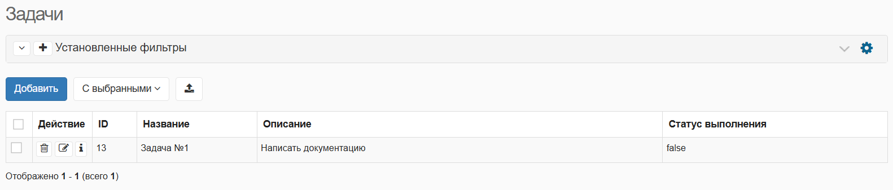

### Change task status in web application

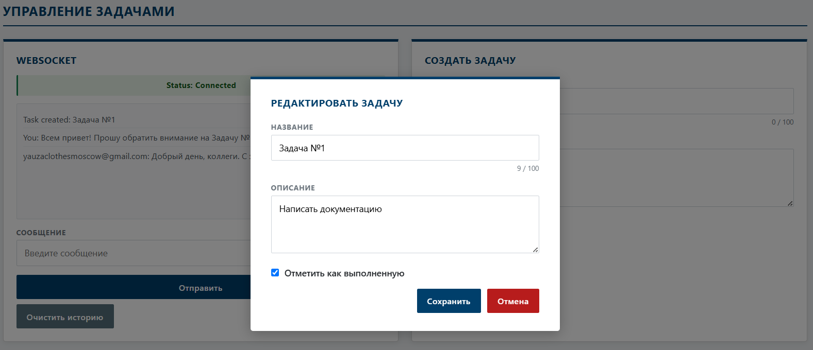

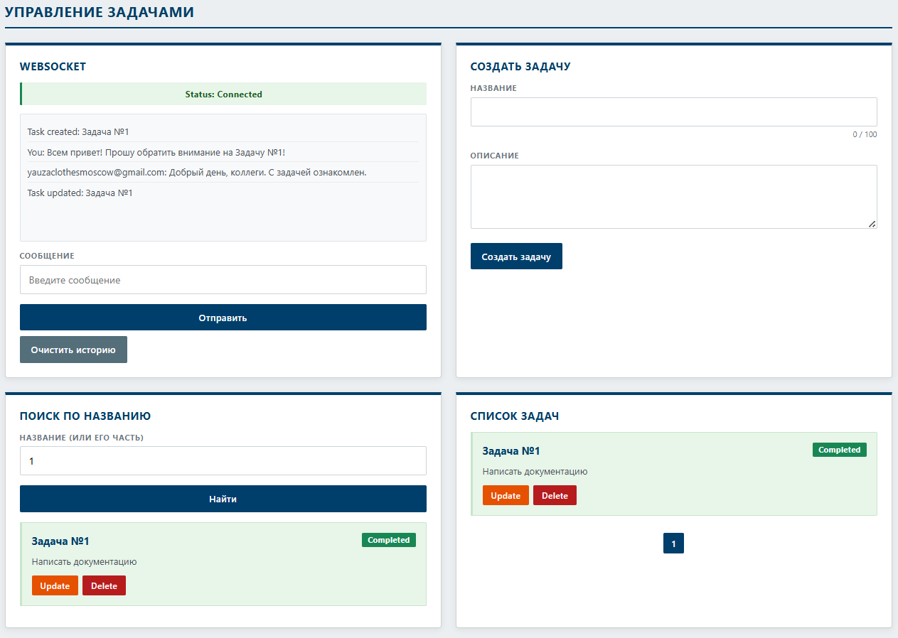

### Task status has changed in CRM

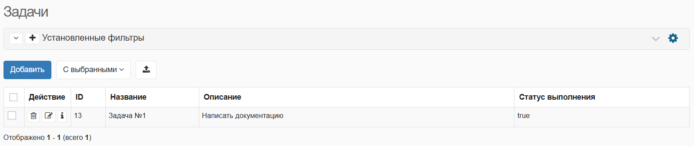

### Protected user profile page

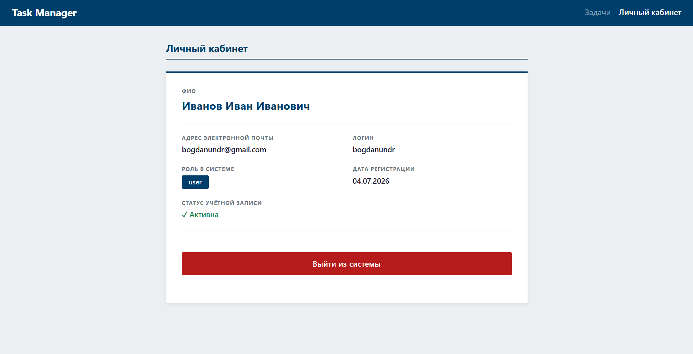

### Login page

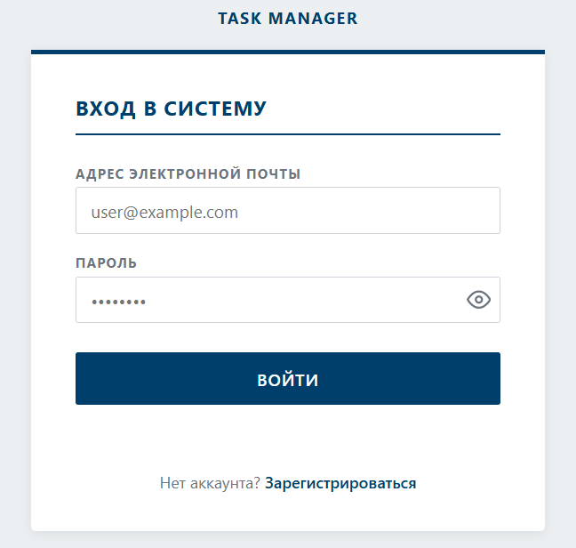

### Registration Pages

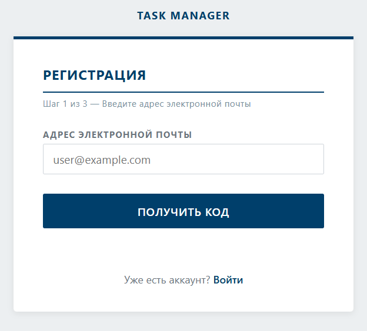

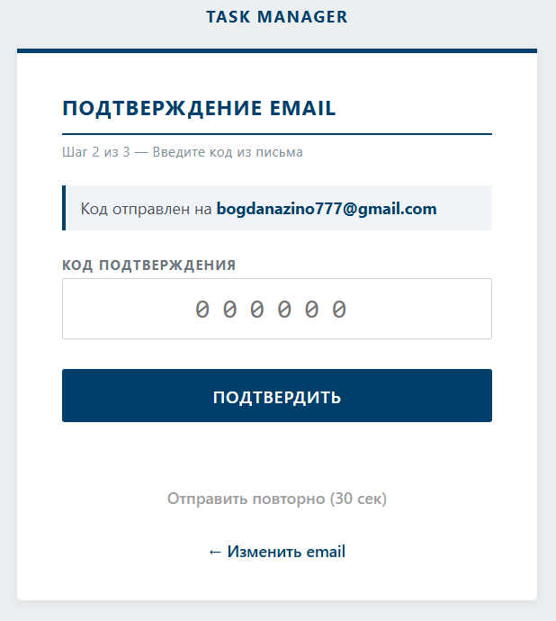

#### Protected registration page

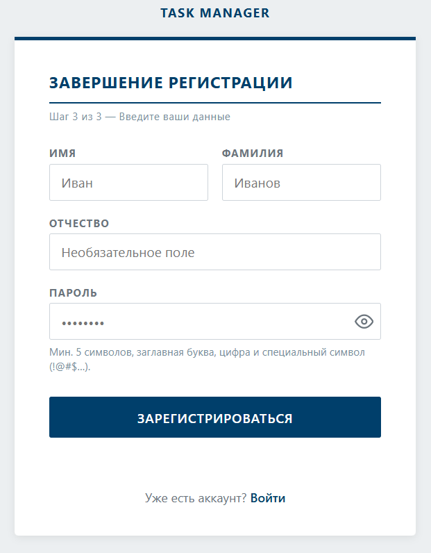

### Users entity in CRM

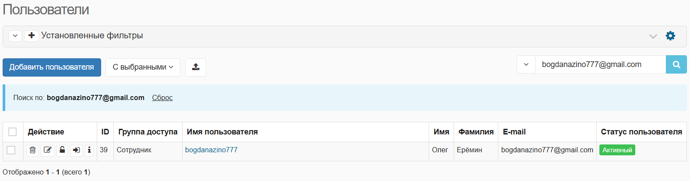

## Technological Stack

<p align="center">
  
</p>

<p align="center">
    <em>Ready-to-use and customizable users management for <a href="https://fastapi.tiangolo.com/">FastAPI</a></em>
</p>

[](https://badge.fury.io/py/fastapi-users)

---

**Documentation**: <a href="https://fastapi-users.github.io/fastapi-users/" target="_blank">https://fastapi-users.github.io/fastapi-users/</a>

**Source Code**: <a href="https://github.com/fastapi-users/fastapi-users" target="_blank">https://github.com/fastapi-users/fastapi-users</a>

---

### Backend
- **Python**: 3.13.3
- **FastAPI**: 0.115.14
- **FastAPI Users**: 15.0.2

### ASGI web server
- **uvicorn**: 0.35.0

### Database
- **PostgreSQL**: 18.0
- **SQLAlchemy**: 2.0.41
- **Alembic**: 1.14.0

### Testing
- **pytest**: 8.3.5
- **pytest-asyncio**: 0.24.0
- **httpx**: 0.27.2
- **Swagger UI**: 5.x (cdn.jsdelivr.net/npm/swagger-ui-dist@5)

### Frontend
- **HTML5**, **CSS3**, **JavaScript**
- **Jinja2**: 3.1.6

---

## Registration Flow

Регистрация разбита на три шага для подтверждения владения email-адресом.
Между шагами 2 и 3 сервер выдаёт короткоживущий JWT (`reg_token`) в HttpOnly-куке —
он служит доказательством того, что email подтверждён, и связывает шаги без серверного состояния.

```mermaid
sequenceDiagram
    autonumber
    participant C as 🌐 Клиент
    participant S as ⚙️ Сервер
    participant D as 🗄️ PostgreSQL
    participant M as 📧 SMTP
    participant R as 🏢 CRM

    rect rgb(219, 234, 254)
        Note over C,R: Шаг 1 — Запрос кода подтверждения
        C->>S: POST /auth/register/request-code
        Note left of C: body: email
        S->>D: SELECT person WHERE email=?
        Note right of S: дубль → 409 EMAIL_ALREADY_REGISTERED<br/>повторный запрос < 60с → 429 RATE_LIMIT
        S->>D: SELECT registration_pending WHERE email=?
        Note right of S: secrets.randbelow(1_000_000) → код<br/>bcrypt.hash(code) → code_hash
        S->>D: INSERT registration_pending (code_hash, expires_at=now+15мин)
        S->>M: send_confirmation_code(email, code)
        M-->>C: Письмо с кодом подтверждения
        S-->>C: 200 OK
        Note left of C: message: Code sent
    end

    rect rgb(254, 243, 199)
        Note over C,R: Шаг 2 — Верификация кода
        C->>S: POST /auth/register/verify-code
        Note left of C: body: email, code
        S->>D: SELECT registration_pending WHERE email=?
        Note right of S: expires_at прошёл → 400 CODE_EXPIRED<br/>attempts >= 3 → 400 TOO_MANY_ATTEMPTS<br/>bcrypt.verify fail → 400 INVALID_CODE
        S->>D: DELETE registration_pending
        Note right of S: jwt.encode(sub=email, purpose=registration,<br/>exp=now+15мин, secret=REG_TOKEN_SECRET)
        S-->>C: 200 OK
        Note left of C: Set-Cookie: reg_token=eyJ...<br/>HttpOnly, SameSite=Strict, Max-Age=900
    end

    rect rgb(209, 250, 229)
        Note over C,R: Шаг 3 — Создание пользователя
        C->>S: POST /auth/register/complete
        Note left of C: Cookie: reg_token=eyJ...<br/>body: firstname, lastname, patronymic?, password
        Note right of S: jwt.decode(reg_token) → email<br/>purpose != registration → 401<br/>password regex fail → 400
        S->>R: action=insert, entity_id=1
        Note right of S: items: group_id, firstname, lastname, username, email
        R-->>S: status=success, data.id=42
        S->>D: INSERT INTO person
        S-->>C: 201 Created
        Note left of C: message: Registration complete<br/>Set-Cookie: reg_token=; Max-Age=0
    end
```

### Коды ошибок регистрации

| Эндпоинт | Код | Detail | Причина |
|---|---|---|---|
| `request-code` | 400 | `INVALID_EMAIL` | Формат email не совпадает с regex |
| `request-code` | 409 | `EMAIL_ALREADY_REGISTERED` | Email уже есть в `person` |
| `request-code` | 429 | `RATE_LIMIT:<sec>` | Повторный запрос до истечения 60 с |
| `request-code` | 503 | `SMTP_ERROR` | SMTP-сервер недоступен |
| `verify-code` | 400 | `NO_PENDING_REGISTRATION` | Нет записи в `registration_pending` |
| `verify-code` | 400 | `CODE_EXPIRED` | `expires_at` истёк (15 мин) |
| `verify-code` | 400 | `TOO_MANY_ATTEMPTS` | 3 неверные попытки исчерпаны |
| `verify-code` | 400 | `INVALID_CODE:<rem>` | Неверный код, `rem` — оставшихся попыток |
| `complete` | 401 | `MISSING_REG_TOKEN` | Кука `reg_token` отсутствует |
| `complete` | 401 | `REG_TOKEN_INVALID` | JWT не прошёл проверку подписи/срока |
| `complete` | 409 | `EMAIL_ALREADY_REGISTERED` | Гонка: email зарегистрирован параллельным запросом |
| `complete` | 503 | `CRM_UNAVAILABLE` | CRM недоступна при создании записи |

---

## Authentication Flow

Аутентификация построена на двух JWT-токенах с раздельными секретами и TTL.
`access_token` используется при каждом запросе, `refresh_token` — только для его обновления.

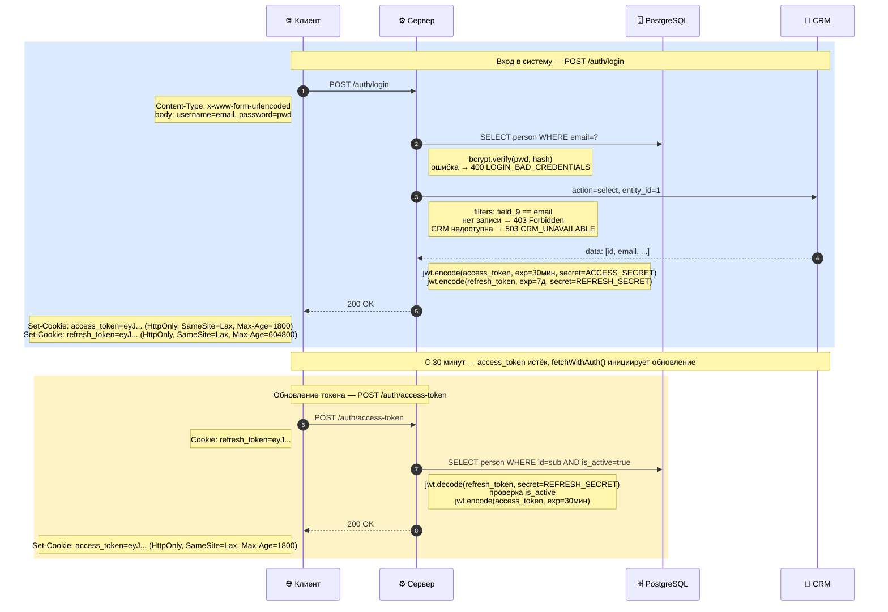

### Токены

| Параметр | access_token | refresh_token |
|---|---|---|
| TTL | 30 мин (`ACCESS_EXP`) | 7 дней (`REFRESH_EXP`) |
| Подписывается | `ACCESS_SECRET` | `REFRESH_SECRET` |
| Кука | `access_token` | `refresh_token` |
| HttpOnly | да | да |
| SameSite | Lax | Lax |
| Используется | все защищённые маршруты | только `POST /auth/access-token` |

`SameSite=Lax` — кука отправляется при top-level navigation (переход по ссылке), но не при cross-site subresource-запросах. Защита от CSRF без ограничений OAuth-редиректов.

Раздельные секреты изолируют компрометацию: утечка `ACCESS_SECRET` не позволяет подделать `refresh_token` и получить долгосрочный доступ.

### Коды ошибок аутентификации

| Эндпоинт | Код | Detail | Причина |
|---|---|---|---|
| `login` | 400 | `LOGIN_BAD_CREDENTIALS` | Неверный пароль или пользователь не найден |
| `login` | 503 | `CRM_UNAVAILABLE` | CRM недоступна при проверке |
| `login` | 403 | — | Пользователь есть в БД, но отсутствует в CRM |
| `access-token` | 401 | — | `refresh_token` отсутствует, просрочен или недействителен |

---

## Endpoints

Интерактивная документация: [http://localhost:8000/docs](http://localhost:8000/docs)

### Регистрация

- `POST /auth/register/request-code` — шаг 1: отправить 6-значный код на email. Тело (JSON): `{ email }`.
- `POST /auth/register/verify-code` — шаг 2: подтвердить код (≤ 3 попытки, TTL 15 мин). Тело (JSON): `{ email, code }`. Выдаёт куку `reg_token` (HttpOnly, SameSite=Strict, TTL 20 мин).
- `POST /auth/register/complete` — шаг 3: создать пользователя. Требует куку `reg_token`. Тело (JSON): `{ firstname, lastname, patronymic?, password }`.

### Аутентификация

- `POST /auth/login` — выдать `access_token` и `refresh_token`. Тело: `application/x-www-form-urlencoded`, поля `username` (email) и `password`.
- `POST /auth/access-token` — обновить `access_token` по `refresh_token`-куке.
- `POST /auth/logout` — JS-вариант выхода: удаляет обе куки, возвращает JSON 200.
- `POST /auth/do-logout` — форм-вариант выхода: удаляет обе куки, возвращает 303 See Other на `/`.

### Задачи (требуют действующий `access_token`)

> **Shared board:** все аутентифицированные пользователи видят один общий список и могут редактировать или удалять любую задачу. Инициатор каждого изменения передаётся остальным через WebSocket (`sender: "user@example.com"`).

- `GET /tasks/` — список всех задач. Параметры: `skip` (≥ 0, по умолчанию 0), `limit` (1–100, по умолчанию 5). Общее число задач — в заголовке `X-Total-Count`.
- `GET /tasks/search?title=...` — поиск по части названия (регистронезависимый ILIKE с экранированием спецсимволов). Поддерживает те же параметры пагинации.
- `POST /create-task/` — создать задачу. `409 Conflict` при дублировании названия.
- `PUT /update-task/{task_id}` — полное или частичное обновление задачи. `409 Conflict` при переименовании в существующее название.
- `DELETE /delete-task/{task_id}` — удалить задачу.

### Управление пользователями (требуют роль `admin`)

> Доступ проверяется через `require_permission("delete")`. Пользователь с ролью `user` (permissions: `["read", "write"]`) получает `403 Forbidden`. Роль `admin` имеет permissions: `["read", "write", "delete"]`.

- `GET /users/` — список всех пользователей.
- `PATCH /users/{user_id}` — изменить данные пользователя (`username`, `firstname`, `lastname`, `patronymic`, `role_id`, `is_active`). `404` если пользователь не найден.
- `DELETE /users/{user_id}` — удалить пользователя. `400` при попытке удалить собственную учётную запись.

### WebSocket

`ws://<host>/ws/tasks/{user_id}` — подключение требует куку `access_token`. Без неё сервер закрывает соединение с кодом `1008 Policy Violation`.

Типы событий:

| `type` | Когда отправляется |
|---|---|
| `chat` | Текстовое сообщение от пользователя |
| `task_created` | Другой пользователь создал задачу |
| `task_updated` | Другой пользователь обновил задачу |
| `task_deleted` | Другой пользователь удалил задачу |

Инициатор действия не получает серверное эхо. При разрыве соединения клиент переподключается через 3 секунды. История чата сохраняется в `localStorage`.

---

## Database Schema

```
role
├── id          INTEGER PK
├── name        VARCHAR      ("user" | "admin")
└── permissions JSON         (["read","write"] | ["read","write","delete"])

person
├── id              INTEGER PK
├── email           VARCHAR(255) UNIQUE
├── username        VARCHAR(255)        (= email до @)
├── firstname       VARCHAR(255)
├── lastname        VARCHAR(255)
├── patronymic      VARCHAR(255) NULL
├── hashed_password VARCHAR(1024)       (bcrypt, rounds=14)
├── registered_at   TIMESTAMP
├── role_id         INTEGER FK → role.id
├── is_active       BOOLEAN
├── is_superuser    BOOLEAN
└── is_verified     BOOLEAN

task
├── id          INTEGER PK
├── title       VARCHAR(100) UNIQUE
├── description VARCHAR(2000)
├── completed   BOOLEAN
├── owner_id    INTEGER FK → person.id
└── crm_task_id INTEGER NULL            (NULL = не синхронизировано с CRM)

registration_pending
├── id          INTEGER PK
├── email       VARCHAR(255) UNIQUE
├── code_hash   VARCHAR(1024)           (bcrypt-хеш 6-значного кода)
├── attempts    INTEGER                 (счётчик неверных попыток, лимит = 3)
├── expires_at  TIMESTAMP               (now + 15 мин)
└── created_at  TIMESTAMP               (используется для rate-limit: 60 с)
```

### Миграции Alembic

| Ревизия | Изменение |
|---|---|
| `0001` | Создание таблиц `role`, `person`, `task` |
| `0002` | Добавление `registration_pending` |
| `0003` | Добавление `firstname`, `lastname`, `crm_task_id` |
| `0004` | Уникальный индекс на `task.title` |
| `0005` | Обновление структуры `person` |
| `0006` | Добавление `patronymic` (nullable) в `person` |

---

## CRM «Руководитель»

Task Manager интегрирован с CRM-системой [«Руководитель»](https://rukovoditel.net/) (open-source PHP/MySQL).
Интеграция работает через REST API CRM и затрагивает два процесса: регистрацию пользователей и управление задачами.

### Регистрация пользователя

При регистрации (`POST /auth/register/complete`) операции выполняются в строгом порядке:

1. **CRM** — `action=insert`, entity_id=1 (Пользователи): `group_id`, `firstname`, `lastname`, `username`, `email`.
2. **PostgreSQL** — `INSERT INTO person` только после успешного ответа CRM.

Если CRM недоступна — `INSERT` не выполняется, клиент получает `503`. Обратный порядок создавал бы риск: пользователь есть в БД, но отсутствует в CRM, что заблокирует ему вход.

### Проверка при входе

При каждом входе (`POST /auth/login`), после проверки пароля, выполняется `action=select` по email (поле 9 сущности «Пользователи»). Если запись не найдена — `403 Forbidden`. Если CRM недоступна — `503`.

### Синхронизация задач (best-effort)

| Событие | CRM-операция | Поведение при ошибке CRM |
|---|---|---|
| Создание задачи | `action=insert`, entity_id=29 | Задача сохраняется в БД, `crm_task_id=NULL`, предупреждение в UI |
| Обновление задачи | `action=update`, `update_by_field={id: crm_task_id}` | Задача обновляется в БД, `crm_synced=false` в ответе |
| Удаление задачи | `action=delete`, `delete_by_field={id: crm_task_id}` | Задача удаляется из БД, `crm_synced=false` в ответе |

### Сущности CRM

| Сущность | entity_id | Поля |
|---|---|---|
| Пользователи | 1 | `group_id`, `firstname`, `lastname`, `username` (= email до `@`), `email`, `password` |
| Задачи | 29 | `field_311` — название, `field_312` — описание, `field_313` — статус (чекбокс: `"true"` / `"false"`) |

### Конфигурация

Переменные окружения в `src/.dev.env`:

```ini
CRM_API_URL=https://your-crm-host/api/rest.php
CRM_API_KEY=your_api_key
CRM_API_USER=api_user
CRM_API_PASSWORD=api_password
CRM_LOGIN_URL=https://your-crm-host/index.php?module=users/login
CRM_DEMO_ID=          # оставить пустым для production, заполнить для demo-инстанса
CRM_USER_GROUP_ID=6   # ID группы «Сотрудник» в CRM
```

### Структура модуля

```
src/crm/
├── config.py        # чтение CRM_* переменных окружения через os.getenv()
├── client.py        # базовый HTTP-клиент (httpx async), метод _call()
├── user_service.py  # поиск пользователя по email (используется при логине)
└── task_service.py  # CRUD-операции с задачами (entity_id=29)
```

### Формат запросов к API

Все запросы — HTTP POST на `/api/rest.php`, тело — JSON.

**Транспорт и аутентификация**

Три поля аутентификации присутствуют в каждом запросе:

```json
{
    "key":      "<API-ключ из Settings → API>",
    "username": "<логин пользователя с ролью API>",
    "password": "<пароль>",
    "action":   "insert|select|update|delete",
    "entity_id": 29
}
```

**action = insert — создание записей**

Поле `items` — массив словарей; каждый словарь — одна создаваемая запись.
Для сущности «Задачи» (entity_id=29) поля именуются `field_<ID>`, где ID — числовой
идентификатор поля в CRM. Статус — строковый чекбокс: `"true"` / `"false"`.

```json
{
    "key": "...", "username": "...", "password": "...",
    "action": "insert",
    "entity_id": 29,
    "items": [
        {
            "field_311": "Название задачи",
            "field_312": "Описание задачи",
            "field_313": "false"
        }
    ]
}
```

Для сущности «Пользователи» (entity_id=1) используются встроенные имена полей,
а не `field_<N>`. Дополнительные параметры `notify` и `login_url` инициируют
отправку приветственного письма:

```json
{
    "key": "...", "username": "...", "password": "...",
    "action": "insert",
    "entity_id": 1,
    "items": [
        {
            "group_id":  6,
            "firstname": "Иван",
            "lastname":  "Иванов",
            "username":  "ivan.ivanov",
            "email":     "ivan@example.com",
            "password":  ""
        }
    ],
    "notify":    true,
    "login_url": "https://crm.example.com/index.php?module=users/login"
}
```

Ответ на успешный `insert` содержит ID созданной записи. ID возвращается строкой:

```json
{"status": "success", "data": {"id": "42"}}
```

**action = select — выборка записей**

Поле `select_fields` — идентификаторы полей через запятую.
Поле `filters` — словарь `{ID_поля: {value, condition}}`.
Условие `"include"` означает точное совпадение (не LIKE).
Идентификаторы полей сущности «Пользователи»: 6=группа, 7=имя, 8=фамилия, 9=email, 12=логин.

```json
{
    "key": "...", "username": "...", "password": "...",
    "action": "select",
    "entity_id": 1,
    "select_fields": "9,7,8,12,6",
    "filters": {
        "9": {
            "value":     "ivan@example.com",
            "condition": "include"
        }
    }
}
```

**action = update — обновление записей**

Поле `data` — словарь обновляемых полей (только изменяемые, не весь объект).
Поле `update_by_field` — критерий поиска записи. `id` здесь — это CRM-ID,
хранящийся в локальной БД как `crm_task_id`.

```json
{
    "key": "...", "username": "...", "password": "...",
    "action": "update",
    "entity_id": 29,
    "data": {
        "field_311": "Новое название задачи",
        "field_313": "true"
    },
    "update_by_field": {"id": 42}
}
```

**action = delete — удаление записей**

Поле `delete_by_field` — критерий поиска удаляемой записи.

```json
{
    "key": "...", "username": "...", "password": "...",
    "action": "delete",
    "entity_id": 29,
    "delete_by_field": {"id": 42}
}
```

**Формат ответа**

CRM «Руководитель» не стандартизирует формат ответа между версиями и операциями.
Клиент проверяет все известные варианты признака успеха:

| Вариант ответа | Интерпретация |
|---|---|
| `{"success": true, ...}` | Успех |
| `{"status": "ok", ...}` | Успех |
| `{"status": "success", "data": {...}}` | Успех |
| `{"result": [...]}` без ключей `"error"` / `"error_message"` | Успех |
| `{"msg": "..."}` | Ошибка |
| `{"error_message": "..."}` | Ошибка |
| Любой ответ с ключом `"error"` | Ошибка |

---

## Local Development

### 1. Создать виртуальное окружение

```
python -m venv .venv
```

### 2. Активировать

Windows:
```
.venv\Scripts\activate
```
Linux/macOS:
```
source .venv/bin/activate
```

### 3. Установить зависимости

```
pip install -r requirements.txt
```

Для запуска тестов:

```
pip install -r requirements-dev.txt
```

### 4. Переменные окружения

Заполните `src/.dev.env`. Обязательные секции:

**База данных и JWT**
```ini
API_MODE=dev          # dev отключает флаг Secure на куках (нет TLS на localhost)
DB_HOST=localhost
DB_PORT=5432
DB_USER=...
DB_PASS=...
DB_NAME=clients

ACCESS_SECRET=...     # случайная строка ≥ 32 символов
ACCESS_EXP=1800       # TTL access_token, сек (30 мин)
REFRESH_SECRET=...    # другая случайная строка ≥ 32 символов
REFRESH_EXP=604800    # TTL refresh_token, сек (7 дней)
REG_TOKEN_SECRET=...  # секрет JWT для reg_token (шаг 2→3 регистрации)
REG_TOKEN_EXP=1200    # TTL reg_token, сек (20 мин)
```

**SMTP (подтверждение email при регистрации)**
```ini
SMTP_HOST=smtp.yandex.ru
SMTP_PORT=465
SMTP_USER=your@yandex.ru
SMTP_PASSWORD=app_password   # пароль приложения, не пароль от аккаунта
```

**CRM «Руководитель»**

Интеграция обязательна: `POST /auth/login` проверяет наличие пользователя в CRM,
`POST /auth/register/complete` создаёт запись в CRM до INSERT в БД.
При недоступности CRM логин и регистрация возвращают 503.

```ini
CRM_API_URL=https://your-crm-host/api/rest.php
CRM_API_KEY=...            # API-ключ из раздела Settings → API в CRM
CRM_API_USER=api_user      # логин пользователя с ролью API
CRM_API_PASSWORD=...
CRM_LOGIN_URL=https://your-crm-host/index.php?module=users/login
CRM_DEMO_ID=               # пусто для production; номер demo-инстанса для тестовой среды
CRM_USER_GROUP_ID=6        # ID группы «Сотрудник» в CRM (entity_id=1, поле group_id)
```

`API_MODE=dev` отключает флаг `Secure` на куках — браузер отправляет их по `http://localhost`.
В production `API_MODE=prod` допустим только при работе через HTTPS.

### 5. Создать базу данных

```sql
CREATE DATABASE clients;
```

### 6. Применить миграции

```
alembic upgrade head
```

Миграции создают таблицы `role`, `person`, `task`, `registration_pending`.
При первом запуске приложения lifespan заполняет `role` базовыми ролями (`user`, `admin`).

Добавить новую миграцию после изменения моделей:

```
alembic revision --autogenerate -m "describe change"
alembic upgrade head
```

### 7. Запустить сервер

```
uvicorn src.main:app --reload
```

---

## Docker Deployment

Приложение запускается в двух контейнерах: `web` (FastAPI + uvicorn) и `db` (PostgreSQL 18).

### Структура файлов

```
task-manager/
├── src/
│   ├── Dockerfile
│   ├── docker-compose.yml
│   └── .dev.env
└── ...
```

### Конфигурация

Перед первым запуском заполните `src/.dev.env`:

```ini
DB_USER=your_db_user
DB_PASS=your_db_password
DB_NAME=clients
ACCESS_SECRET=your_random_secret_32_chars_min
REFRESH_SECRET=another_random_secret_32_chars_min
```

> `DB_HOST` указывать не нужно — docker-compose переопределяет его на `db` (имя сервиса внутри Docker-сети).

### Команды

```bash
# Сборка и запуск
docker-compose -f src/docker-compose.yml up --build

# Запуск в фоне
docker-compose -f src/docker-compose.yml up -d

# Логи
docker-compose -f src/docker-compose.yml logs -f web

# Остановка
docker-compose -f src/docker-compose.yml down

# Остановка с удалением данных БД
docker-compose -f src/docker-compose.yml down -v
```

### Применение миграций

```
docker-compose -f src/docker-compose.yml exec web alembic upgrade head
```

### Доступ

| Сервис | Адрес |
|---|---|
| API + UI | http://localhost:8000 |
| Swagger UI | http://localhost:8000/docs |
| PostgreSQL | localhost:5432 |

---

## Testing

Тесты используют отдельную базу данных `clients_test`, чтобы не затрагивать данные разработки.

### Локальный запуск

**1. Создать тестовую базу данных**

```sql
CREATE DATABASE clients_test;
```

Запускать миграции не нужно — фикстура `setup_and_reset` выполняет `drop_all + create_all`
перед каждым тестом, гарантируя соответствие схемы текущим ORM-моделям.

**2. Установить dev-зависимости**

```
pip install -r requirements-dev.txt
```

Содержимое `requirements-dev.txt`: `pytest==8.3.5`, `pytest-asyncio==0.24.0`.
`httpx` уже в `requirements.txt` и дополнительной установки не требует.

**3. Проверить `src/.tests.env`**

Файл содержит тестовые учётные данные (`DB_NAME=clients_test`).
Если PostgreSQL запущен с другими `DB_USER` / `DB_PASS` — отредактируйте файл.

Переключение на тестовую БД происходит автоматически: корневой `conftest.py` загружает
`.tests.env` с `override=True` до первого импорта `src.*`. CRM и SMTP не нужны —
фикстуры `mock_crm` и `mock_smtp` перехватывают все обращения к ним.

**4. Запустить тесты**

```
pytest tests/ -v
```

### Запуск тестов внутри Docker-контейнера

`conftest.py` сохраняет `DB_HOST` из окружения контейнера перед вызовом `load_dotenv`,
поэтому `DB_HOST=db` (выставленный docker-compose) не перезаписывается значением из `.tests.env`.

```bash
# 1. Создать тестовую базу (один раз)
docker exec src-db-1 psql -U root -d clients -c "CREATE DATABASE clients_test WITH OWNER = root;"

# 2. Установить dev-зависимости в контейнер (один раз)
docker exec src-web-1 pip install -r requirements-dev.txt -q

# 3. Запустить тесты
docker exec src-web-1 python -m pytest tests/ -v
```

### Фикстуры

| Фикстура / функция | Scope | Назначение |
|---|---|---|
| `setup_and_reset` | function, autouse | Перед тестом: `drop_all + create_all` + заполнение ролей. После: нет (схема пересоздаётся следующим тестом) |
| `client` | function | `httpx.AsyncClient` с `ASGITransport` — HTTP-запросы к приложению без TCP |
| `mock_crm` | function, autouse | Патч `CRMClient`, `CRMUserSelector`, `TaskManager` через `unittest.mock.patch` |
| `mock_smtp` | function, autouse | Перехват `send_confirmation_code`; код сохраняется в `dict[email, code]` |
| `register_and_login` | function | Полный трёхшаговый flow регистрации через HTTP |
| `promote_to_admin` | — | Повышает пользователя до `role_id=2` напрямую в БД |

> `httpx.ASGITransport` не запускает ASGI lifespan (`startup`/`shutdown`).
> Инициализация схемы и ролей выполняется напрямую в `setup_and_reset`, а не через lifespan.

### Покрытие тестами

| Модуль | Сценарии |
|---|---|
| `test_auth.py` | Логин (успех / неверный пароль / несуществующий пользователь), выход (JS-вариант), refresh-токен (успех / без куки) |
| `test_registration_flow.py` | request-code (успех / нормализация email / невалидный email / дубль / rate-limit), verify-code (успех / нет pending / неверный код / счётчик попыток / лимит исчерпан / невалидный формат), complete (успех / без токена / слабый пароль / пустой firstname), полный flow + логин, patronymic (с отчеством / без / хранение NULL / возврат значения) |
| `test_tasks.py` | Создание (успех / дубль / без авторизации), чтение (пагинация / вторая страница), поиск, обновление (успех / частичное / дубль title / 404), удаление, совместный доступ |
| `test_users.py` | Список (admin / обычный пользователь 403 / без авторизации 401), удаление (успех / 403 / 404), редактирование (успех / 403) |
| `test_crm.py` | CRM-клиент: создание / обновление / удаление задачи, поиск пользователя |
| `test_pages.py` | HTML-маршруты: login / register / task-board / profile / complete-registration (без reg_token → редирект) |
