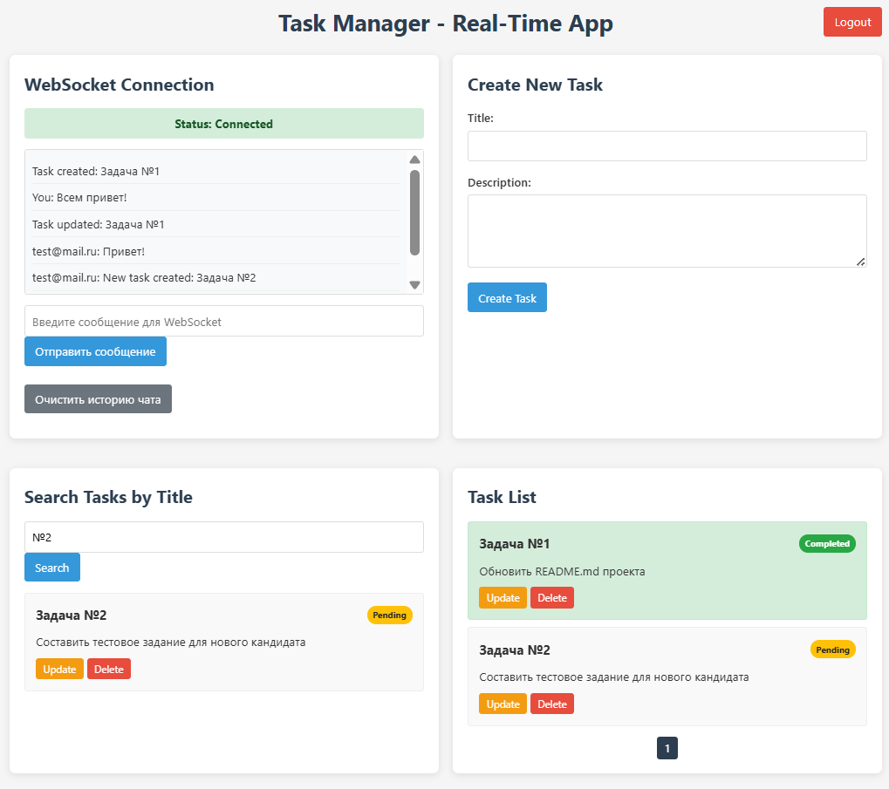
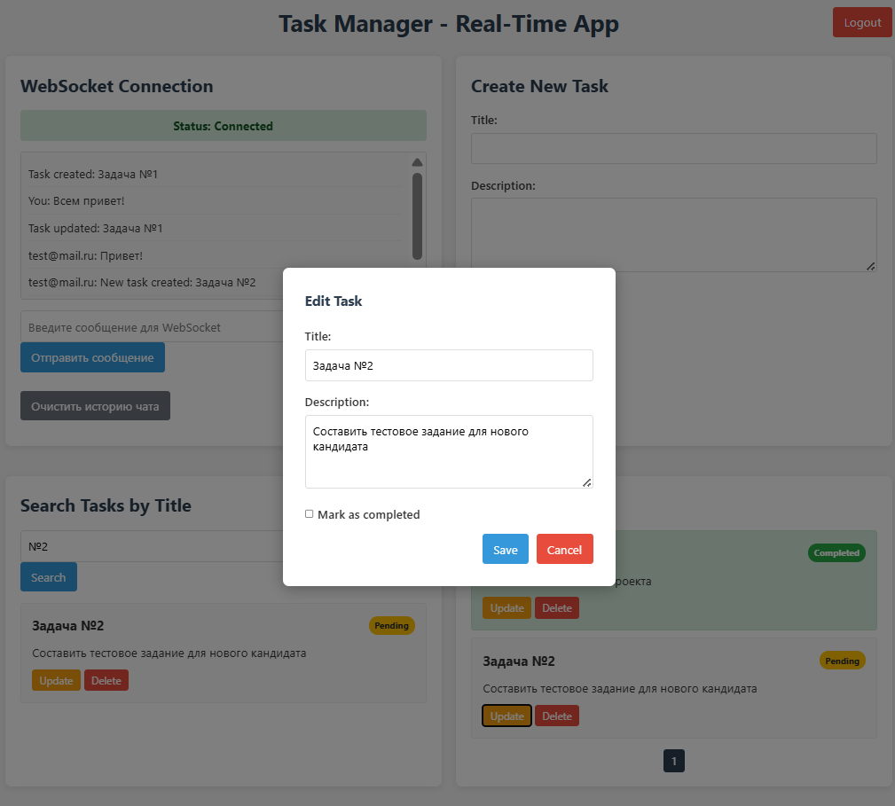
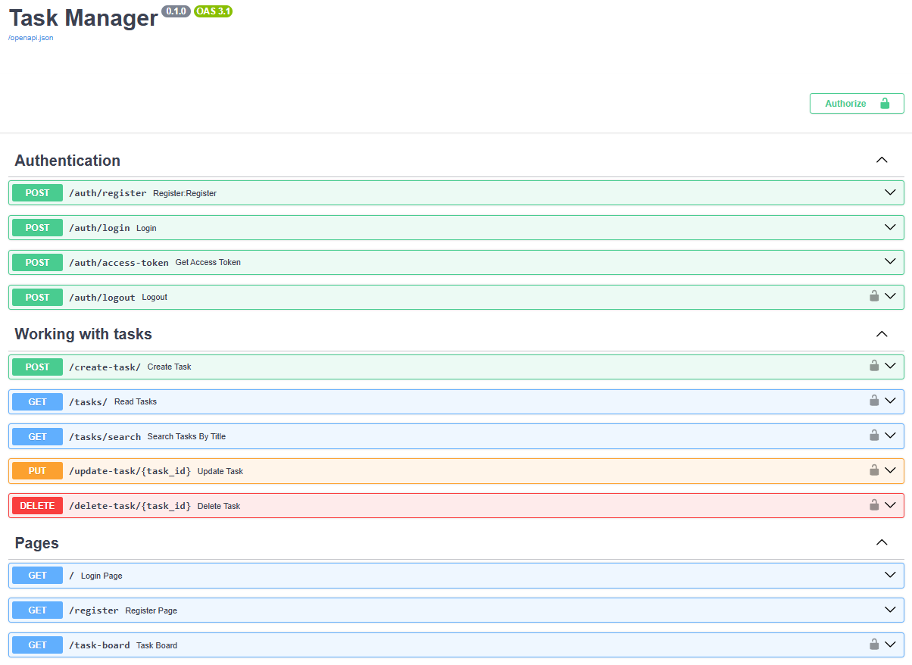
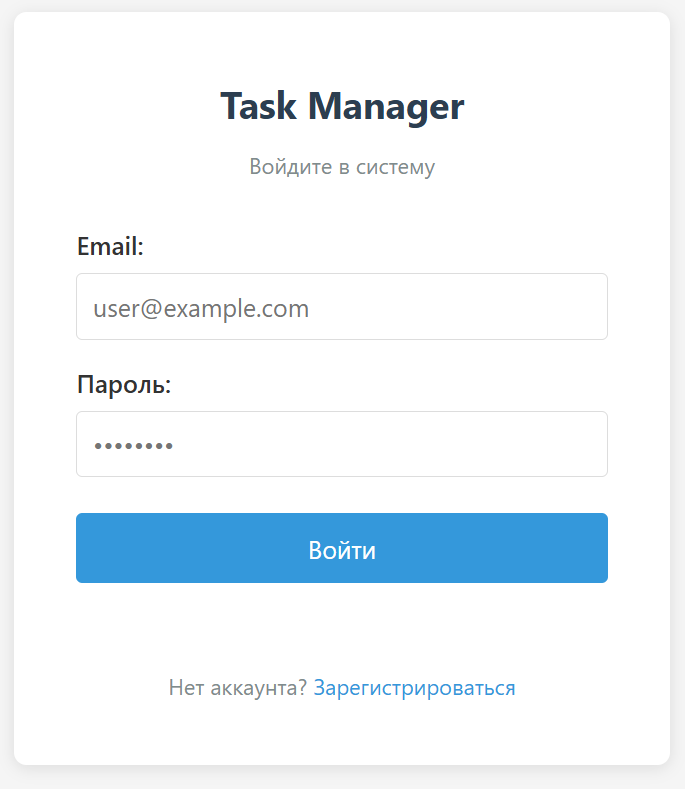
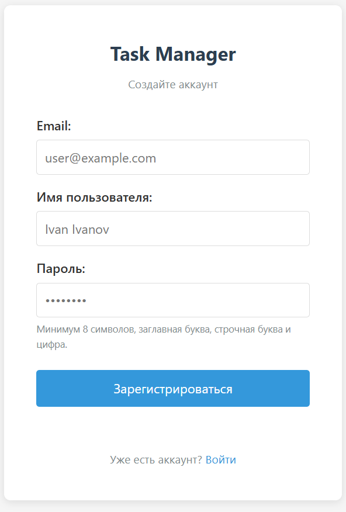

# Task Manager

## Screenshots

### Protected Pages





### Swagger UI



### Login page



### Registration page



## Technological Stack

<p align="center">
  
</p>

<p align="center">
    <em>Ready-to-use and customizable users management for <a href="https://fastapi.tiangolo.com/">FastAPI</a></em>
</p>

[](https://badge.fury.io/py/fastapi-users)

---

**Documentation**: <a href="https://fastapi-users.github.io/fastapi-users/" target="_blank">https://fastapi-users.github.io/fastapi-users/</a>

**Source Code**: <a href="https://github.com/fastapi-users/fastapi-users" target="_blank">https://github.com/fastapi-users/fastapi-users</a>

---

### Backend
- **Python**: 3.13.5
- **FastAPI**: 0.115.14
- **FastAPI Users**: 15.0.2

### ASGI web server
- **uvicorn**: 0.35.0

### Database
- **PostgreSQL**: 18.0
- **SQLAlchemy**: 2.0.41
- **Alembic**: 1.14.0

### Testing
- **pytest**: 8.3.5
- **pytest-asyncio**: 0.24.0
- **httpx**: 0.27.2
- **Swagger UI**: 5.26.0

### Frontend
- **HTML5**, **CSS3**, **JavaScript**
- **Jinja2**: 3.1.6

## Authentication Process

1. **Login and Password Request**
   The client sends a request to the server with an object containing the user's login and password.

2. **Token Generation**
   If the entered password is correct, the server generates an access token and a refresh token and returns them to the client
   as `access_token` and `refresh_token` cookies. Both cookies are set with `HttpOnly` (защита от XSS) and `SameSite=Lax` (защита от CSRF).

3. **Using the Access Token**
   The client uses the received access token to interact with the API. All subsequent requests to protected routes must
   include this token in the cookie.

4. **Access Token Renewal**
   The access token has a validity period of 30 minutes (`ACCESS_EXP`, in seconds).
   When the access token expires, the client sends a request to `POST /auth/access-token` using the
   long-lived `refresh_token` cookie (`REFRESH_EXP`, 7 days by default) and receives a new access token.
   This does **not** require a still-valid access token.

## Endpoints

Доступ к интерактивной документации Swagger UI и маршрутам аутентификации
можно получить по адресу: [http://localhost:8000/docs](http://localhost:8000/docs)

- `POST http://localhost:8000/auth/login` — JWT аутентификация (выдаёт `access_token` и `refresh_token`). Принимает `application/x-www-form-urlencoded`: поля `username` (email) и `password`. Применяет те же проверки формата email/пароля, что и при регистрации.
- `POST http://localhost:8000/auth/logout` — Выход из системы (защищённая конечная точка, удаляет обе куки).
- `POST http://localhost:8000/auth/register` — Регистрация нового пользователя. Тело запроса (JSON): `username`, `email`, `password`. Требования к паролю: минимум 8 символов, хотя бы одна строчная буква, одна заглавная буква и одна цифра (OWASP baseline).
- `POST http://localhost:8000/auth/access-token` — Получение нового access токена по `refresh_token`.

Маршруты задач (все защищены: требуют действующий `access_token`):

> **Shared board:** приложение реализует модель совместной доски задач — все аутентифицированные пользователи видят один общий список и могут редактировать или удалять любую задачу. Инициатор каждого изменения передаётся остальным участникам через WebSocket (`sender: "user@example.com"`). Такой подход выбран намеренно: приложение предназначено для командной работы, а не для изолированных личных списков.

- `GET http://localhost:8000/tasks/` — Получение списка **всех** задач из БД. Параметры: `skip` (≥ 0, по умолчанию 0), `limit` (1–100, по умолчанию 5). Общее количество задач возвращается в заголовке `X-Total-Count`.
- `GET http://localhost:8000/tasks/search?title=...` — Поиск задач по части названия (регистронезависимый ILIKE). Поддерживает те же параметры пагинации и заголовок `X-Total-Count`.
- `POST http://localhost:8000/create-task/` — Создание новой задачи. Возвращает `409 Conflict`, если задача с таким названием уже существует.
- `PUT http://localhost:8000/update-task/{task_id}` — Частичное или полное обновление задачи (любой авторизованный пользователь). Возвращает `409 Conflict` при попытке переименовать в уже существующее название.
- `DELETE http://localhost:8000/delete-task/{task_id}` — Удаление задачи (любой авторизованный пользователь).

Маршруты управления пользователями (требуют роль `admin`):

> Доступ проверяется через `require_permission("delete")`: пользователь с ролью `user` (permissions: `["read", "write"]`) получает `403 Forbidden`. Только пользователь с ролью `admin` (permissions: `["read", "write", "delete"]`) проходит проверку.

- `GET http://localhost:8000/users/` — Список всех зарегистрированных пользователей.
- `PATCH http://localhost:8000/users/{user_id}` — Изменение данных пользователя (`username`, `role_id`, `is_active`). Возвращает `404`, если пользователь не найден.
- `DELETE http://localhost:8000/users/{user_id}` — Удаление учётной записи пользователя. Возвращает `404`, если пользователь не найден.

**WebSocket** — протокол связи поверх TCP-соединения (см. Модель OSI), предназначенный для обмена сообщениями между браузером и веб-сервером,
используя постоянное соединение:

  - Использует собственный протокол `ws://` или `wss://` поверх TCP-соединения.
  - Соединение остается открытым, позволяя серверу и клиенту обмениваться данными в реальном времени без повторных запросов.
  - Сервер может самостоятельно инициировать отправку данных клиенту (например, уведомления, чаты, онлайн-игры).
  - Данные передаются в виде кадров (frames) с минимальными накладными расходами.

Для получения обновлений статуса задачи в режиме реального времени используйте WebSocket-подключение к `ws://<host>/ws/tasks/{user_id}`.
Подключение требует действующую куку `access_token` (получается через `/auth/login`) — без неё сервер закрывает соединение с кодом `1008`.

Протокол WebSocket определяется автоматически на основе протокола страницы:

| Протокол страницы | WebSocket-протокол |
|---|---|
| `http://` | `ws://` |
| `https://` | `wss://` |

При деплое за reverse proxy (nginx) браузер устанавливает `wss://`-соединение с nginx,
а nginx проксирует его на uvicorn по `ws://` внутри сети. Для корректной работы необходима
следующая конфигурация nginx:

```nginx
location /ws/ {
    proxy_pass http://localhost:8000;
    proxy_http_version 1.1;
    proxy_set_header Upgrade $http_upgrade;
    proxy_set_header Connection "upgrade";
}
```

Без заголовков `Upgrade` и `Connection` nginx разрывает WebSocket-соединение сразу после рукопожатия.

Поведение WebSocket-чата:

- Все события о задачах подписываются email-ом инициатора: `user@mail.com: New task created: Задача №1`.
- Инициатор изменения не получает серверное эхо собственного действия.
- При получении события о задаче (`created` / `updated` / `deleted`) список задач у всех подключённых пользователей обновляется автоматически без перезагрузки страницы.
- Список задач загружается из БД автоматически при каждом подключении к WebSocket.
- История чата сохраняется в `localStorage` и восстанавливается при следующей загрузке страницы.

## Local development

### 1. Setting Up a Virtual Environment

```
python -m venv venv
```

### 2. Activate the virtual environment

Windows:
```
venv\Scripts\activate
```
Linux/MacOS:
```
source venv/bin/activate
```

### 3. Install dependencies

```
pip install -r requirements.txt
```

Для запуска тестов установите dev-зависимости (pytest, pytest-asyncio, httpx):

```
pip install -r requirements-dev.txt
```

### 4. Configuring Environment Variables

Заполните файл `src/.dev.env`:

```
DB_USER=...
DB_PASS=...
ACCESS_SECRET=...   # случайная строка ≥ 32 символов
REFRESH_SECRET=...  # другая случайная строка ≥ 32 символов
```

`API_MODE=dev` уже выставлен в `.dev.env` — этот режим отключает флаг `Secure` на auth-куках,
чтобы браузер отправлял их по `http://localhost`. Используйте `prod` только при работе через HTTPS.

### 5. Create a `clients` database in PostgreSQL

```sql
CREATE DATABASE clients;
```

### 6. Apply database migrations

```
alembic upgrade head
```

Миграции создают таблицы `role`, `person`, `task` и уникальный индекс на `task.title`.
При первом запуске приложения lifespan заполняет таблицу `role` базовыми ролями (`user`, `admin`).

Для генерации новой миграции после изменения моделей:

```
alembic revision --autogenerate -m "describe change"
alembic upgrade head
```

> **Рекомендуемый подход для продакшна** — запускать миграции явно перед стартом приложения
> (например, в entrypoint Docker-контейнера):
>
> ```
> alembic upgrade head && uvicorn src.main:app --host 0.0.0.0 --port 8000
> ```

### 7. Start the server

```
uvicorn src.main:app --reload
```

---

## Docker deployment

Приложение запускается в двух контейнерах: `web` (FastAPI + uvicorn) и `db` (PostgreSQL 18).

### Структура файлов

```
task-manager/          ← корень проекта (все docker-команды запускать здесь)
├── src/
│   ├── Dockerfile
│   ├── docker-compose.yml
│   └── .dev.env       ← переменные окружения (заполнить перед запуском)
└── ...
```

### Конфигурация переменных окружения

Перед первым запуском заполните `src/.dev.env`:

```
DB_USER=your_db_user
DB_PASS=your_db_password
DB_NAME=clients
ACCESS_SECRET=your_random_secret_32_chars_min
REFRESH_SECRET=another_random_secret_32_chars_min
```

> `DB_HOST` указывать не нужно — docker-compose автоматически переопределяет его на `db`
> (имя сервиса внутри Docker-сети).

### Запуск

Все команды выполняются из **корня проекта**:

#### Сборка и запуск
```
docker-compose -f src/docker-compose.yml up --build
```

#### Запуск в фоне
```
docker-compose -f src/docker-compose.yml up -d
```

#### Просмотр логов
```
docker-compose -f src/docker-compose.yml logs -f web
```

#### Остановка
```
docker-compose -f src/docker-compose.yml down
```

#### Остановка с удалением данных БД
```
docker-compose -f src/docker-compose.yml down -v
```

### Применение миграций

После первого запуска контейнеров выполните миграции Alembic:

```
docker-compose -f src/docker-compose.yml exec web alembic upgrade head
```

Базовые роли (`user`, `admin`) создаются автоматически при старте приложения через lifespan.

### Доступ к приложению

| Сервис | Адрес |
|--------|-------|
| API + UI | http://localhost:8000 |
| Swagger UI | http://localhost:8000/docs |
| PostgreSQL | localhost:5432 |

## Testing

Тесты используют отдельную базу данных, чтобы не затрагивать данные разработки.

### 1. Создайте тестовую базу данных

```sql
CREATE DATABASE clients_test;
```

Запускать миграции (`alembic upgrade head`) вручную не нужно — фикстура `setup_and_reset`
создаёт таблицы и заполняет роли автоматически перед каждым тестом.
Для тестов, требующих права администратора, используется вспомогательная функция `promote_to_admin(email)`, которая напрямую обновляет `role_id` пользователя в БД.

### 2. Установите dev-зависимости

```
pip install -r requirements-dev.txt
```

### 3. Проверьте `src/.tests.env`

Файл уже содержит тестовые учётные данные (`DB_USER=root`, `DB_PASS=12345`).
Если ваш PostgreSQL использует другие значения — отредактируйте их.
`API_MODE=test` переключает приложение на базу `clients_test` автоматически.

### 4. Запустите тесты

```
pytest tests/ -v
```

### Как работают фикстуры

| Фикстура / функция | Scope | Назначение |
|----------|-------|-----------|
| `setup_and_reset` | function, autouse | Перед тестом: `create_all` + заполнение ролей. После теста: `TRUNCATE task, person` |
| `client` | function | `httpx.AsyncClient` с `ASGITransport` для HTTP-запросов к приложению |
| `promote_to_admin` | — | Вспомогательная функция: повышает пользователя до `role_id=2` (admin) напрямую в БД |

> **Примечание.** `httpx.ASGITransport` обрабатывает только HTTP-запросы и не запускает
> ASGI lifespan (`startup` / `shutdown`). Поэтому инициализация таблиц и ролей
> выполняется напрямую в фикстуре, а не через lifespan приложения.

### Запуск тестов внутри Docker-контейнера

Если приложение уже запущено через docker-compose, тесты можно выполнить прямо в контейнере:

```bash
# 1. Создать тестовую базу данных (один раз)
docker exec src-db-1 psql -U root -d clients -c "CREATE DATABASE clients_test WITH OWNER = root;"

# 2. Установить dev-зависимости в контейнер
docker exec src-web-1 sh -c "pip install -r requirements-dev.txt -q"

# 3. Запустить тесты
#    conftest.py загружает .tests.env с override=True, поэтому DB_HOST
#    нужно изменить на имя сервиса "db" внутри Docker-сети.
docker exec src-web-1 sh -c "
  sed -i 's/DB_HOST=localhost/DB_HOST=db/' src/.tests.env &&
  python -m pytest tests/ -v
  sed -i 's/DB_HOST=db/DB_HOST=localhost/' src/.tests.env
"
```

> Шаги 1 и 2 нужны только один раз. После этого достаточно повторять шаг 3.
> Файл `src/.tests.env` восстанавливается к исходному значению (`DB_HOST=localhost`) в конце команды.

### Покрытие тестами

| Модуль | Сценарии |
|--------|----------|
| `test_auth.py` | Регистрация (успех / дубль / невалидный email / слабый пароль), логин (успех / неверный пароль / несуществующий пользователь), выход, refresh-токен (успех / без куки) |
| `test_tasks.py` | Создание (успех / дубль / без авторизации / пустой title), чтение (пустой список / пагинация / вторая страница / невалидные параметры), поиск (найдено / не найдено / без авторизации), обновление (успех / частичное / дубль title / 404 / без авторизации), удаление (успех / 404 / без авторизации), совместный доступ (другой пользователь может редактировать и удалять чужие задачи, видит все задачи) |
| `test_users.py` | Список пользователей (admin — успех / обычный пользователь — 403 / без авторизации — 401), удаление пользователя (admin — успех / обычный пользователь — 403 / 404), редактирование пользователя (admin — успех / обычный пользователь — 403) |
