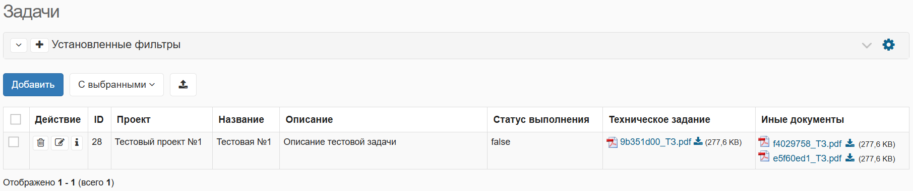
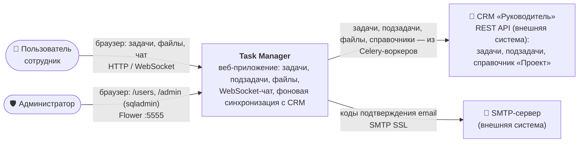
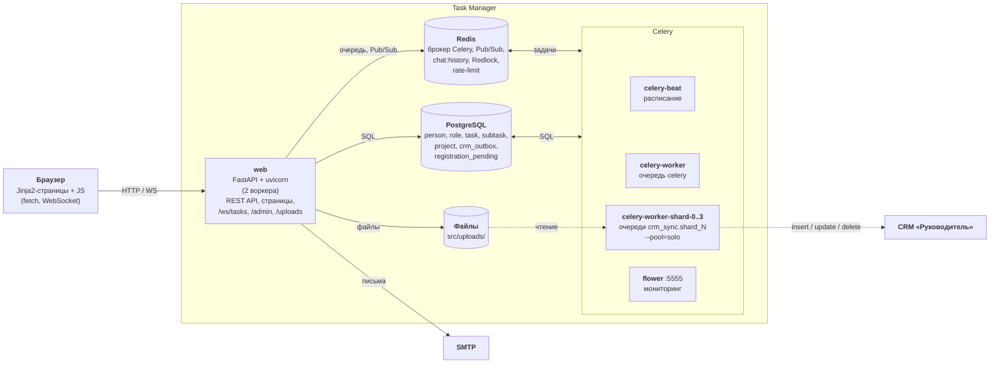
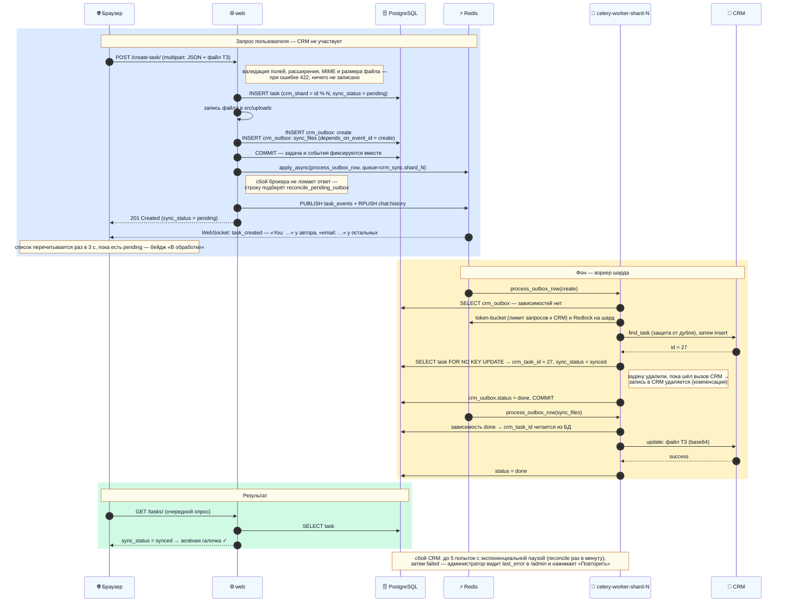
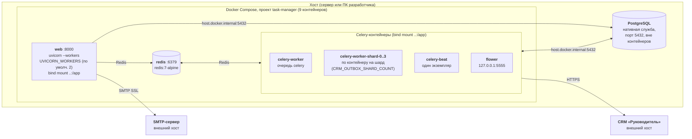
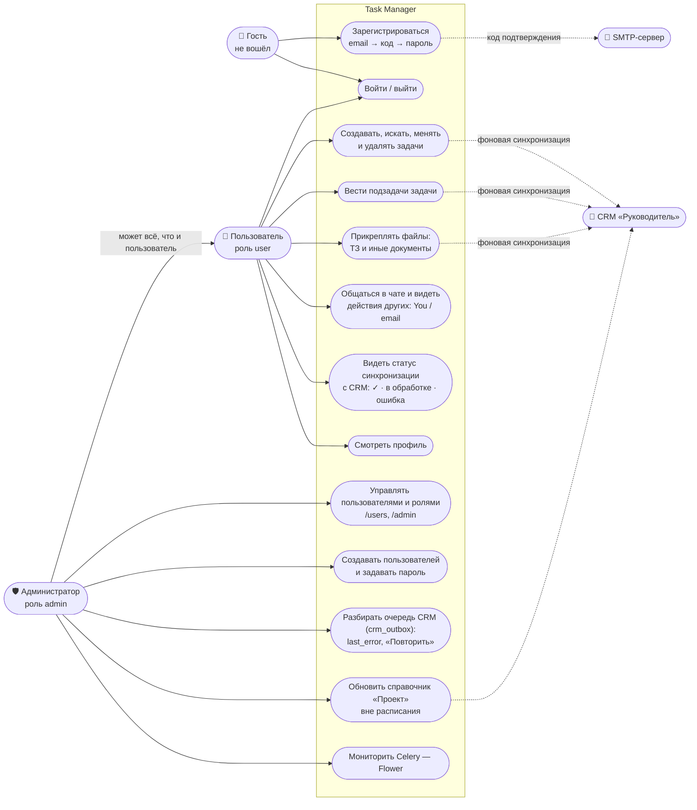
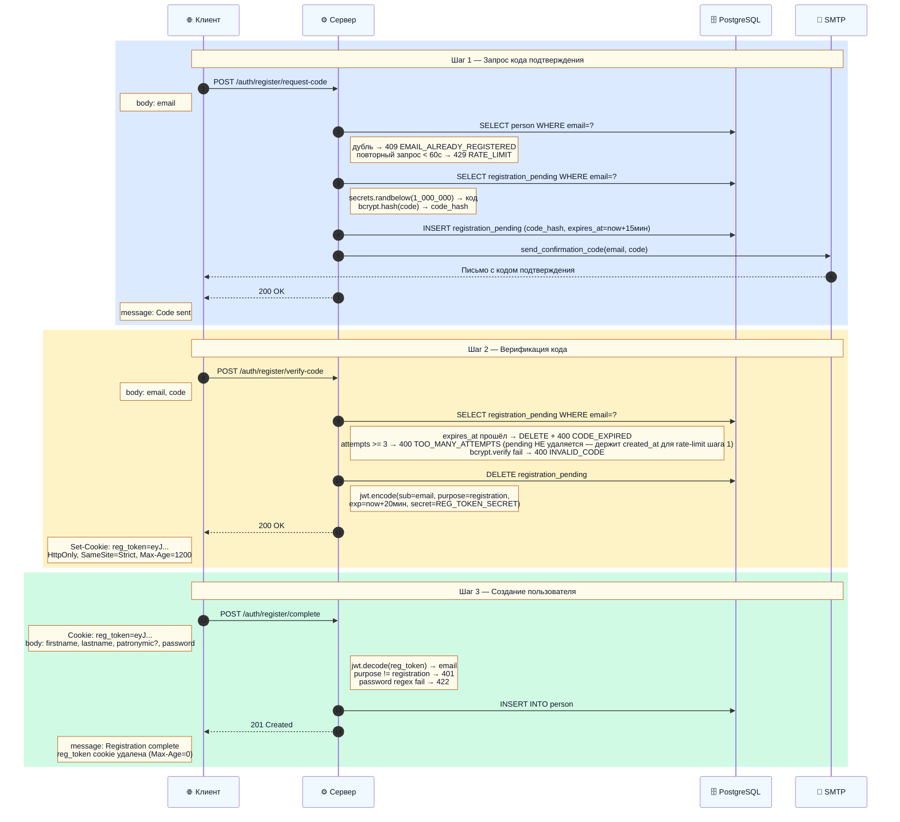
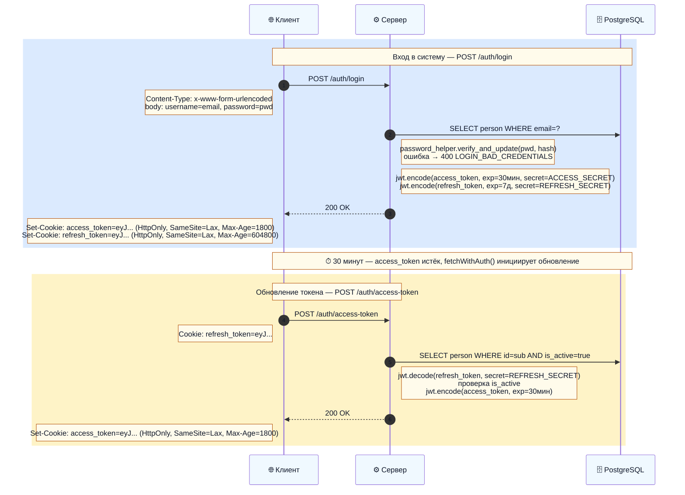

# Task Manager

Веб-приложение для совместной работы с задачами и подзадачами: общая доска, файлы (ТЗ и «иные документы»), WebSocket-чат и фоновая синхронизация данных с CRM «Руководитель» через Celery + Redis (transactional outbox). Стек: FastAPI, SQLAlchemy (async), PostgreSQL, Celery, Redis, sqladmin.

## Screenshots

### Task board page


### List of tasks in CRM



### Loading global list values from CRM


### Board of subtasks linked to a parent task


### Subtask page


### List of subtasks in CRM


### Protected user profile page


### Login page


### Registration Pages


#### Protected registration page


### CRM synchronization status visibility — administrator only


### SQLAdmin pages


### Flower Monitoring Pages


## Technological Stack

### Backend
- **Python**: 3.13.3
- **FastAPI**: 0.115.14
- **FastAPI Users**: 15.0.2
- **Swagger UI / ReDoc** (OpenAPI): интерактивное описание API; JS/CSS, favicon и шрифты лежат в `src/static`, внешние CDN не используются

### ASGI web server
- **uvicorn**: 0.35.0 (с `websockets`)

### File uploads
- **python-magic-bin**: 0.4.14 — определение MIME-типа по сигнатуре байтов (Windows-сборка libmagic; на Linux/macOS — `python-magic` + системный `libmagic1`)

### Database
- **PostgreSQL**: 18.0
- **SQLAlchemy**: 2.0.41
- **Alembic**: 1.14.0

### Testing
- **pytest**: 8.3.5
- **pytest-asyncio**: 0.24.0
- **httpx**: 0.27.2

### Frontend
- **HTML5**, **CSS3**, **JavaScript**
- **Jinja2**: 3.1.6

### Task queue & cache
- **Celery**: 5.4.0 — фоновые задачи: durable-retry очередь CRM-синхронизации (`crm_outbox`), периодическая загрузка справочника «Проект»
- **Redis**: 5.0.8 (клиент; сервер — образ `redis:7-alpine` в Docker) — брокер Celery, Pub/Sub-канал для WebSocket между несколькими uvicorn-воркерами, история WS-чата (`chat:history`), Redlock, token-bucket ограничитель запросов к CRM

### Admin panel & monitoring
- **sqladmin**: 0.20.1 (+ `wtforms` 3.1.2, `itsdangerous` 2.2.0) — админ-панель `/admin`: пользователи (создание, сброс пароля), роли, задачи, подзадачи, справочник «Проект», очередь `crm_outbox` (просмотр и действие «Повторить»)
- **Flower**: 2.0.1 — веб-мониторинг Celery (порт 5555, только loopback)

---

## Диаграммы архитектуры

### 1. Контекстная диаграмма

Границы системы: кто с ней работает и от каких внешних систем она зависит.


```mermaid
flowchart LR
    user(["👤 Пользователь<br/>сотрудник"])
    admin(["🛡️ Администратор"])
    tm["<b>Task Manager</b><br/>веб-приложение: задачи, подзадачи, файлы,<br/>WebSocket-чат, фоновая синхронизация с CRM"]
    crm["🏢 CRM «Руководитель»<br/>REST API (внешняя система):<br/>задачи, подзадачи, справочник «Проект»"]
    smtp["📧 SMTP-сервер<br/>(внешняя система)"]

    user -->|"браузер: задачи, файлы, чат<br/>HTTP / WebSocket"| tm
    admin -->|"браузер: /users, /admin (sqladmin)<br/>Flower :5555"| tm
    tm -->|"задачи, подзадачи, файлы, справочники — из Celery-воркеров"| crm
    tm -->|"коды подтверждения email<br/>SMTP SSL"| smtp
```

Пользователь и администратор работают через браузер; CRM — единственная
система, куда уходят данные задач, и вызывается она **не из HTTP-запроса**,
а исключительно фоновыми Celery-воркерами. Регистрация и вход в приложение
CRM не затрагивают вообще.

### 2. Диаграмма контейнеров

Из каких развёртываемых единиц состоит система и как они связаны.


```mermaid
%%{init: {"flowchart": {"nodeSpacing": 40, "rankSpacing": 110, "curve": "basis", "htmlLabels": true, "padding": 15}}}%%
flowchart LR
    browser["<b>Браузер</b><br/>Jinja2-страницы + JS<br/>(fetch, WebSocket)"]

    subgraph tm["Task Manager"]
        direction LR
        web["<b>web</b><br/>FastAPI + uvicorn<br/>(2 воркера)<br/>REST API, страницы,<br/>/ws/tasks, /admin, /uploads"]
        pg[("<b>PostgreSQL</b><br/>person, role, task, subtask,<br/>project, crm_outbox,<br/>registration_pending")]
        redis[("<b>Redis</b><br/>брокер Celery, Pub/Sub,<br/>chat:history, Redlock,<br/>rate-limit")]
        fs[("<b>Файлы</b><br/>src/uploads/")]

        subgraph celery["Celery"]
            beat["<b>celery-beat</b><br/>расписание"]
            wdef["<b>celery-worker</b><br/>очередь celery"]
            wshard["<b>celery-worker-shard-0..3</b><br/>очереди crm_sync.shard_N<br/>--pool=solo"]
            flower["<b>flower</b> :5555<br/>мониторинг"]
        end
    end

    smtp["<b>SMTP</b>"]
    crm["<b>CRM «Руководитель»</b>"]

    browser -->|"HTTP / WS"| web
    web -->|"SQL"| pg
    web -->|"очередь, Pub/Sub"| redis
    web -->|"файлы"| fs
    web -->|"письма"| smtp
    redis <-->|"задачи"| celery
    pg <-->|"SQL"| celery
    fs -.->|"чтение"| wshard
    wshard -.->|"insert / update / delete"| crm
```

Ключевая связка: `web` вставляет строку `crm_outbox` в ту же транзакцию PostgreSQL,
что и изменение задачи, и кладёт её в очередь `crm_sync.shard_N` Redis; на каждый шард
приходится ровно один воркер (`--pool=solo`), поэтому события одной задачи
обрабатываются строго по порядку. Redis выполняет четыре роли: брокер Celery,
канал Pub/Sub для рассылки WebSocket-событий между воркерами `web`, история чата
и служебные ключи (Redlock шарда, ограничитель запросов к CRM).

### 3. Диаграмма последовательностей

Сценарий: пользователь создаёт задачу с файлом — от HTTP-запроса до появления
задачи в CRM и галочки `✓` в интерфейсе.


```mermaid
%%{init: {'theme': 'default', 'themeVariables': {'noteTextColor': '#0f172a', 'noteBkgColor': '#fffbeb', 'noteBorderColor': '#b45309', 'signalTextColor': '#0f172a', 'actorTextColor': '#0f172a', 'actorBkg': '#f0f9ff', 'actorBorderColor': '#0284c7', 'labelTextColor': '#0f172a', 'sequenceNumberColor': '#0f172a'}}}%%
sequenceDiagram
    autonumber
    participant B as 🌐 Браузер
    participant W as ⚙️ web
    participant D as 🗄️ PostgreSQL
    participant R as ⚡ Redis
    participant K as 🧵 celery-worker-shard-N
    participant C as 🏢 CRM

    rect rgb(219, 234, 254)
        Note over B,R: Запрос пользователя — CRM не участвует
        B->>W: POST /create-task/ (multipart: JSON + файл ТЗ)
        Note right of W: валидация полей, расширения, MIME и размера файла —<br/>при ошибке 422, ничего не записано
        W->>D: INSERT task (crm_shard = id % N, sync_status = pending)
        W->>W: запись файла в src/uploads
        W->>D: INSERT crm_outbox: create<br/>INSERT crm_outbox: sync_files (depends_on_event_id = create)
        W->>D: COMMIT — задача и события фиксируются вместе
        W->>R: apply_async(process_outbox_row, queue=crm_sync.shard_N)
        Note right of W: сбой брокера не ломает ответ —<br/>строку подберёт reconcile_pending_outbox
        W->>R: PUBLISH task_events + RPUSH chat:history
        W-->>B: 201 Created (sync_status = pending)
        R-->>B: WebSocket: task_created — «You: …» у автора, «email: …» у остальных
        Note over B: список перечитывается раз в 3 с, пока есть pending — бейдж «В обработке»
    end

    rect rgb(254, 243, 199)
        Note over R,C: Фон — воркер шарда
        R->>K: process_outbox_row(create)
        K->>D: SELECT crm_outbox — зависимостей нет
        K->>R: token-bucket (лимит запросов к CRM) и Redlock на шард
        K->>C: find_task (защита от дубля), затем insert
        C-->>K: id = 27
        K->>D: SELECT task FOR NO KEY UPDATE → crm_task_id = 27, sync_status = synced
        Note right of K: задачу удалили, пока шёл вызов CRM →<br/>запись в CRM удаляется (компенсация)
        K->>D: crm_outbox.status = done, COMMIT
        R->>K: process_outbox_row(sync_files)
        K->>D: зависимость done → crm_task_id читается из БД
        K->>C: update: файл ТЗ (base64)
        C-->>K: success
        K->>D: status = done
    end

    rect rgb(209, 250, 229)
        Note over B,D: Результат
        B->>W: GET /tasks/ (очередной опрос)
        W->>D: SELECT task
        W-->>B: sync_status = synced → зелёная галочка ✓
    end

    Note over K,D: сбой CRM: до 5 попыток с экспоненциальной паузой (reconcile раз в минуту),<br/>затем failed — администратор видит last_error в /admin и нажимает «Повторить»
```

### 4. Диаграмма развёртывания

Где что запускается, как масштабируется и что переживает сбои.


```mermaid
%%{init: {"flowchart": {"nodeSpacing": 50, "rankSpacing": 120, "curve": "basis", "htmlLabels": true, "padding": 15}}}%%
flowchart LR
    smtp["<b>SMTP-сервер</b><br/>внешний хост"]

    subgraph host["Хост (сервер или ПК разработчика)"]
        direction LR

        subgraph compose["Docker Compose, проект task-manager (9 контейнеров)"]
            direction LR
            web["<b>web</b> :8000<br/>uvicorn --workers<br/>UVICORN_WORKERS (по умолч. 2)<br/>bind mount ..:/app"]
            redis[("<b>redis</b> :6379<br/>redis:7-alpine")]

            subgraph workers["Celery-контейнеры (bind mount ..:/app)"]
                wdef["<b>celery-worker</b><br/>очередь celery"]
                wsh["<b>celery-worker-shard-0..3</b><br/>по контейнеру на шард<br/>(CRM_OUTBOX_SHARD_COUNT)"]
                beat["<b>celery-beat</b><br/>один экземпляр"]
                flower["<b>flower</b><br/>127.0.0.1:5555"]
            end
        end

        pg[("<b>PostgreSQL</b><br/>нативная служба,<br/>порт 5432, вне контейнеров")]
    end

    crm["<b>CRM «Руководитель»</b><br/>внешний хост"]

    web -->|"SMTP SSL"| smtp
    web -->|"Redis"| redis
    redis <-->|"Redis"| workers
    web -->|"host.docker.internal:5432"| pg
    workers <-->|"host.docker.internal:5432"| pg
    workers -->|"HTTPS"| crm
```

| Что | Как масштабируется / что происходит при сбое |
|---|---|
| `web` | Число воркеров uvicorn — `UVICORN_WORKERS`; WebSocket-события доходят между воркерами через Redis Pub/Sub, sticky-сессий не нужно. Перезапуск: `restart: unless-stopped` |
| Шарды CRM-очереди | Пропускная способность растёт числом шардов: новый шард = новый сервис `celery-worker-shard-N` + `CRM_OUTBOX_SHARD_COUNT`. Уменьшать число нельзя, пока в `task.crm_shard` есть значения снятых шардов. На шард — ровно один процесс (`concurrency=1`), иначе теряется порядок событий |
| `celery-beat` | Единственный экземпляр (иначе периодические задачи ставились бы дважды) |
| Падение воркера или Redis | События не теряются: строки лежат в PostgreSQL (`crm_outbox`), `reconcile_pending_outbox` каждую минуту возвращает зависшие в очередь |
| Redis без тома | История WS-чата и очереди не переживают пересоздание контейнера — включение AOF описано в разделе «Сохранение данных Redis (том + AOF)» ниже |
| PostgreSQL | Нативная служба хоста, в compose её нет; размер пула — `DB_POOL_SIZE` + `DB_MAX_OVERFLOW` на каждый процесс |

### 5. Диаграмма вариантов использования

Что доступно каждой роли. Администратор — тот же пользователь с дополнительной
ролью `admin` (роли many-to-many): ему доступно всё, что и обычному пользователю.


```mermaid
flowchart LR
    guest(["👤 Гость<br/>не вошёл"])
    user(["👤 Пользователь<br/>роль user"])
    admin(["🛡️ Администратор<br/>роль admin"])
    smtp(["📧 SMTP-сервер"])
    crm(["🏢 CRM «Руководитель»"])

    subgraph sys["Task Manager"]
        direction TB
        uc1(["Зарегистрироваться<br/>email → код → пароль"])
        uc2(["Войти / выйти"])
        uc3(["Создавать, искать, менять<br/>и удалять задачи"])
        uc4(["Вести подзадачи задачи"])
        uc5(["Прикреплять файлы:<br/>ТЗ и иные документы"])
        uc6(["Общаться в чате и видеть<br/>действия других: You / email"])
        uc7(["Видеть статус синхронизации<br/>с CRM: ✓ · в обработке · ошибка"])
        uc8(["Смотреть профиль"])
        uc9(["Управлять пользователями и ролями<br/>/users, /admin"])
        uc10(["Создавать пользователей<br/>и задавать пароль"])
        uc11(["Разбирать очередь CRM (crm_outbox):<br/>last_error, «Повторить»"])
        uc12(["Обновить справочник «Проект»<br/>вне расписания"])
        uc13(["Мониторить Celery — Flower"])
    end

    guest --> uc1
    guest --> uc2
    user --> uc2
    user --> uc3
    user --> uc4
    user --> uc5
    user --> uc6
    user --> uc7
    user --> uc8
    admin -->|"может всё, что и пользователь"| user
    admin --> uc9
    admin --> uc10
    admin --> uc11
    admin --> uc12
    admin --> uc13

    uc1 -.->|"код подтверждения"| smtp
    uc3 -.->|"фоновая синхронизация"| crm
    uc4 -.->|"фоновая синхронизация"| crm
    uc5 -.->|"фоновая синхронизация"| crm
    uc12 -.-> crm
```

---

## Registration Flow

Регистрация разбита на три шага для подтверждения владения email-адресом.
Между шагами 2 и 3 сервер выдаёт короткоживущий JWT (`reg_token`) в HttpOnly-куке —
он служит доказательством того, что email подтверждён, и связывает шаги без серверного состояния.


```mermaid
%%{init: {'theme': 'default', 'themeVariables': {'noteTextColor': '#0f172a', 'noteBkgColor': '#fffbeb', 'noteBorderColor': '#b45309', 'signalTextColor': '#0f172a', 'actorTextColor': '#0f172a', 'actorBkg': '#f0f9ff', 'actorBorderColor': '#0284c7', 'labelTextColor': '#0f172a', 'sequenceNumberColor': '#0f172a'}}}%%
sequenceDiagram
    autonumber
    participant C as 🌐 Клиент
    participant S as ⚙️ Сервер
    participant D as 🗄️ PostgreSQL
    participant M as 📧 SMTP

    rect rgb(219, 234, 254)
        Note over C,M: Шаг 1 — Запрос кода подтверждения
        C->>S: POST /auth/register/request-code
        Note left of C: body: email
        S->>D: SELECT person WHERE email=?
        Note right of S: дубль → 409 EMAIL_ALREADY_REGISTERED<br/>повторный запрос < 60с → 429 RATE_LIMIT
        S->>D: SELECT registration_pending WHERE email=?
        Note right of S: secrets.randbelow(1_000_000) → код<br/>bcrypt.hash(code) → code_hash
        S->>D: INSERT registration_pending (code_hash, expires_at=now+15мин)
        S->>M: send_confirmation_code(email, code)
        M-->>C: Письмо с кодом подтверждения
        S-->>C: 200 OK
        Note left of C: message: Code sent
    end

    rect rgb(254, 243, 199)
        Note over C,M: Шаг 2 — Верификация кода
        C->>S: POST /auth/register/verify-code
        Note left of C: body: email, code
        S->>D: SELECT registration_pending WHERE email=?
        Note right of S: expires_at прошёл → DELETE + 400 CODE_EXPIRED<br/>attempts >= 3 → 400 TOO_MANY_ATTEMPTS (pending НЕ удаляется — держит created_at для rate-limit шага 1)<br/>bcrypt.verify fail → 400 INVALID_CODE
        S->>D: DELETE registration_pending
        Note right of S: jwt.encode(sub=email, purpose=registration,<br/>exp=now+20мин, secret=REG_TOKEN_SECRET)
        S-->>C: 200 OK
        Note left of C: Set-Cookie: reg_token=eyJ...<br/>HttpOnly, SameSite=Strict, Max-Age=1200
    end

    rect rgb(209, 250, 229)
        Note over C,M: Шаг 3 — Создание пользователя
        C->>S: POST /auth/register/complete
        Note left of C: Cookie: reg_token=eyJ...<br/>body: firstname, lastname, patronymic?, password
        Note right of S: jwt.decode(reg_token) → email<br/>purpose != registration → 401<br/>password regex fail → 422
        S->>D: INSERT INTO person
        S-->>C: 201 Created
        Note left of C: message: Registration complete<br/>reg_token cookie удалена (Max-Age=0)
    end
```

### Коды ошибок регистрации

| Эндпоинт | Код | Detail | Причина |
|---|---|---|---|
| `request-code` | 400 | `INVALID_EMAIL` | Формат email не совпадает с regex |
| `request-code` | 409 | `EMAIL_ALREADY_REGISTERED` | Email уже есть в `person` |
| `request-code` | 429 | `RATE_LIMIT:<sec>` | Повторный запрос до истечения 60 с |
| `request-code` | 503 | `SMTP_ERROR` | SMTP-сервер недоступен |
| `verify-code` | 400 | `NO_PENDING_REGISTRATION` | Нет записи в `registration_pending` |
| `verify-code` | 400 | `CODE_EXPIRED` | `expires_at` истёк (15 мин) |
| `verify-code` | 400 | `TOO_MANY_ATTEMPTS` | 3 неверные попытки исчерпаны; запись `registration_pending` **не удаляется** (иначе следующий `request-code` обходил бы 60-секундный rate-limit — см. таблицу `registration_pending` ниже) |
| `verify-code` | 400 | `INVALID_CODE:<rem>` | Неверный код, `rem` — оставшихся попыток |
| `complete` | 401 | `MISSING_REG_TOKEN` | Кука `reg_token` отсутствует |
| `complete` | 401 | `REG_TOKEN_INVALID` | JWT не прошёл проверку подписи/срока |
| `complete` | 409 | `EMAIL_ALREADY_REGISTERED` | Гонка: email зарегистрирован параллельным запросом |
| `complete` | 422 | текст требований к паролю / ошибка валидации | Пароль не соответствует требованиям (заглавная буква, цифра, спецсимвол, 5–72 символа) или не заполнены имя/фамилия |

`complete` в CRM не обращается вообще — регистрация пользователя в CRM (была best-effort) удалена целиком, поэтому 503 `CRM_UNAVAILABLE` эндпоинт не возвращает и не возвращал бы даже при недоступной CRM.

---

## Authentication Flow

Аутентификация построена на двух JWT-токенах с раздельными секретами и TTL.
`access_token` используется при каждом запросе, `refresh_token` — только для его обновления.


```mermaid
%%{init: {'theme': 'default', 'themeVariables': {'noteTextColor': '#0f172a', 'noteBkgColor': '#fffbeb', 'noteBorderColor': '#b45309', 'signalTextColor': '#0f172a', 'actorTextColor': '#0f172a', 'actorBkg': '#f0f9ff', 'actorBorderColor': '#0284c7', 'labelTextColor': '#0f172a', 'sequenceNumberColor': '#0f172a'}}}%%
sequenceDiagram
    autonumber
    participant C as 🌐 Клиент
    participant S as ⚙️ Сервер
    participant D as 🗄️ PostgreSQL

    rect rgb(219, 234, 254)
        Note over C,D: Вход в систему — POST /auth/login
        C->>S: POST /auth/login
        Note left of C: Content-Type: x-www-form-urlencoded<br/>body: username=email, password=pwd
        S->>D: SELECT person WHERE email=?
        Note right of S: password_helper.verify_and_update(pwd, hash)<br/>ошибка → 400 LOGIN_BAD_CREDENTIALS
        Note right of S: jwt.encode(access_token, exp=30мин, secret=ACCESS_SECRET)<br/>jwt.encode(refresh_token, exp=7д, secret=REFRESH_SECRET)
        S-->>C: 200 OK
        Note left of C: Set-Cookie: access_token=eyJ... (HttpOnly, SameSite=Lax, Max-Age=1800)<br/>Set-Cookie: refresh_token=eyJ... (HttpOnly, SameSite=Lax, Max-Age=604800)
    end

    Note over C,D: ⏱ 30 минут — access_token истёк, fetchWithAuth() инициирует обновление

    rect rgb(254, 243, 199)
        Note over C,S: Обновление токена — POST /auth/access-token
        C->>S: POST /auth/access-token
        Note left of C: Cookie: refresh_token=eyJ...
        S->>D: SELECT person WHERE id=sub AND is_active=true
        Note right of S: jwt.decode(refresh_token, secret=REFRESH_SECRET)<br/>проверка is_active<br/>jwt.encode(access_token, exp=30мин)
        S-->>C: 200 OK
        Note left of C: Set-Cookie: access_token=eyJ... (HttpOnly, SameSite=Lax, Max-Age=1800)
    end
```

Вход больше не обращается к CRM вообще — проверка «пользователь есть в БД, но
отсутствует в CRM» удалена целиком (была реализована через
`CRMUserSelector.find_user_by_email`, вызывавшийся на каждый `/auth/login`).
Единственная проверка на вход теперь — совпадение пароля с хешем в
PostgreSQL. Регистрация (`POST /auth/register/complete`) тоже больше не
обращается к CRM — раньше она best-effort создавала там запись пользователя
первым шагом, это убрано целиком (см. «CRM «Руководитель»» ниже).

### Токены

| Параметр | access_token | refresh_token |
|---|---|---|
| TTL | 30 мин (`ACCESS_EXP`) | 7 дней (`REFRESH_EXP`) |
| Подписывается | `ACCESS_SECRET` | `REFRESH_SECRET` |
| Кука | `access_token` | `refresh_token` |
| HttpOnly | да | да |
| SameSite | Lax | Lax |
| Используется | все защищённые маршруты | только `POST /auth/access-token` |

`SameSite=Lax` — кука отправляется при top-level navigation (переход по ссылке), но не при cross-site subresource-запросах. Защита от CSRF без ограничений OAuth-редиректов.

Раздельные секреты изолируют компрометацию: утечка `ACCESS_SECRET` не позволяет подделать `refresh_token` и получить долгосрочный доступ.

### Коды ошибок аутентификации

| Эндпоинт | Код | Detail | Причина |
|---|---|---|---|
| `login` | 400 | `LOGIN_BAD_CREDENTIALS` | Неверный пароль или пользователь не найден |
| `access-token` | 401 | — | `refresh_token` отсутствует, просрочен или недействителен |

---

## Endpoints

### Swagger UI / OpenAPI

Интерактивное описание API строится автоматически из кода (FastAPI) и доступно после запуска сервера:

| Адрес | Что это |
|---|---|
| `/docs` | Swagger UI — просмотр эндпоинтов и вызов через «Try it out» |
| `/redoc` | ReDoc — то же описание в виде читаемой документации |
| `/openapi.json` | Схема OpenAPI 3 (для генераторов клиентов и импорта в Postman) |

- **Что описано.** Все REST-эндпоинты (задачи, подзадачи, файлы, пользователи, регистрация, вход, `/admin/crm-*`,
  `/chat/history`) с параметрами, схемами ответов и реальными кодами ошибок (`400`/`401`/`403`/`404`/`409`/`413`/`422`/`429`/`503`).
  Не входят: WebSocket (`/ws/tasks/{client_id}` — OpenAPI его не описывает, см. раздел «WebSocket»), раздача файлов
  `/uploads/*` и sqladmin (`/admin`).
- **Авторизация.** Эндпоинты защищены кукой `access_token`. Сначала выполните `POST /auth/login` в Swagger UI (или войдите
  на странице `/` в этом же браузере) — кука подставится в последующие запросы «Try it out».
- **Создание задачи и подзадачи** (`POST /create-task/`, `POST /create-subtask/`) принимают `multipart/form-data`: JSON —
  строкой в поле `data`, файлы — в `specification` и `other_files`. Формат и пример JSON указаны в описании поля `data`.
- **Без внешних ресурсов.** Бандлы Swagger UI и ReDoc, favicon и стили раздаются из `/static`; страницы работают без интернета.
- **Отключение.** Переменная `DOCS_ENABLED` (см. «Переменные окружения»): не задана — документация включена везде, кроме
  `API_MODE=prod`; `true`/`false` — явное значение. Если документация выключена, `/docs`, `/redoc` и `/openapi.json`
  отвечают `404`. Значение читается при старте — после изменения перезапустите сервер.

### Страницы (HTML)

- `/` — вход, `/register` — регистрация, шаг 1; `/confirm-email` — шаг 2; `/complete-registration` — шаг 3.
- `/task-board` — общая доска задач (со списком, поиском и WebSocket-чатом); `/task/{task_id}` — страница задачи; `/subtask-board/{task_id}` — подзадачи задачи; `/subtask/{subtask_id}` — страница подзадачи; `/profile` — профиль.
- `/admin/crm-sync` — страница статуса CRM-синхронизации (только `admin`); `/admin` — sqladmin-панель.

Страницы, требующие входа, при отсутствии сессии перенаправляют браузер на `/`; запросы `fetch` получают JSON `401`.

### Регистрация

- `POST /auth/register/request-code` — шаг 1: отправить 6-значный код на email. Тело (JSON): `{ email }`.
- `POST /auth/register/verify-code` — шаг 2: подтвердить код (≤ 3 попытки, TTL 15 мин). Тело (JSON): `{ email, code }`. Выдаёт куку `reg_token` (HttpOnly, SameSite=Strict, TTL 20 мин).
- `POST /auth/register/complete` — шаг 3: создать пользователя. Требует куку `reg_token`. Тело (JSON): `{ firstname, lastname, patronymic?, password }`.

### Аутентификация

- `POST /auth/login` — выдать `access_token` и `refresh_token`. Тело: `application/x-www-form-urlencoded`, поля `username` (email) и `password`.
- `POST /auth/access-token` — обновить `access_token` по `refresh_token`-куке.
- `POST /auth/logout` — JS-вариант выхода: удаляет обе куки, возвращает JSON 200.
- `POST /auth/do-logout` — форм-вариант выхода: удаляет обе куки, возвращает 303 See Other на `/`.

### Задачи (требуют действующий `access_token`)

> **Shared board:** все аутентифицированные пользователи видят один общий список и могут создавать, редактировать и удалять любую задачу. Инициатор каждого изменения передаётся остальным через WebSocket (`sender: "user@example.com"`).

- `GET /tasks/` — список всех задач. Параметры: `skip` (≥ 0, по умолчанию 0), `limit` (1–100, по умолчанию 5). Общее число задач — в заголовке `X-Total-Count`. Порядок — по возрастанию `id` (стабильная пагинация: обновление задачи не перемещает её между страницами).
- `GET /tasks/search?title=...` — поиск по части названия (регистронезависимый ILIKE с экранированием спецсимволов). Поддерживает те же параметры пагинации.
- `GET /tasks/{task_id}` — получить задачу по ID; включает поле `subtask_count`. `404` если задача не найдена.
- `POST /create-task/` — создать задачу (`201 Created`). Тело — `multipart/form-data`: JSON задачи в form-поле `data` (`{ title, description, project? }`) + необязательные файлы `specification` (ТЗ) и `other_files` (до 10). Задача и файлы создаются одним запросом: все файлы валидируются до записи в БД (недопустимый файл → `422`, ничего не создаётся); сбой сохранения отдельного файла на диск не отменяет создание — причины возвращаются в поле ответа `file_upload_errors`. Опциональное поле `project` — CRM-ID опции справочника «Проект» (см. раздел CRM ниже); неизвестный/неактивный CRM-ID → `422`. `409 Conflict` при дублировании названия у того же владельца.
- `PATCH /tasks/{task_id}` — частичное обновление задачи (только переданные поля). `project: ""` очищает поле, отсутствие ключа — не трогает. `409 Conflict` при переименовании в существующее название.
- `DELETE /delete-task/{task_id}` — удалить задачу; каскадно удаляет все её подзадачи.

### Подзадачи (требуют действующий `access_token`)

> Все аутентифицированные пользователи могут создавать, редактировать и удалять подзадачи любой задачи.

- `POST /create-subtask/` — создать подзадачу (`201 Created`). Тело — `multipart/form-data`: JSON `{ task_id, title, description }` в form-поле `data` + необязательные файлы `specification` и `other_files` (семантика та же, что у `POST /create-task/`, включая `file_upload_errors`). `404` если родительская задача не найдена. `409 Conflict` при дублировании названия в рамках той же задачи.
- `GET /subtasks/` — список подзадач задачи. Параметры: `task_id` (обязательный), `skip` (≥ 0), `limit` (1–100, по умолчанию 20). Общее число — в заголовке `X-Total-Count`.
- `GET /subtasks/{subtask_id}` — получить подзадачу по ID. `404` если не найдена.
- `PATCH /subtasks/{subtask_id}` — частичное обновление подзадачи. `409 Conflict` при дублировании названия.
- `DELETE /delete-subtask/{subtask_id}` — удалить подзадачу.

### Файлы задач (требуют действующий `access_token`)

Файлы хранятся на диске в `src/uploads/tasks/{task_id}/...`; в БД — только относительные пути (`specification_path`, `other_file_paths`). Раздача — не `StaticFiles`-mount, а отдельный маршрут `GET /uploads/{path}` с `Depends(current_user)`: файлы недоступны без авторизации. Допустимые форматы: `.pdf`, `.doc`, `.docx`, `.xls`, `.xlsx`, `.jpg`, `.jpeg`, `.png`, `.txt` (расширение и MIME-сигнатура по magic bytes проверяются отдельно). Лимит размера — 100 МБ на файл. Загрузка/удаление ставит durable-outbox-строку `sync_files` (см. «Синхронизация задач» ниже) и рассылает WebSocket-событие `task_files_updated`.

- `POST /tasks/{task_id}/specification` — загрузить (или заменить) файл технического задания. `multipart/form-data`, поле `file`. `404` если задача не найдена, `413` при превышении размера, `422` при недопустимом расширении/MIME.
- `DELETE /tasks/{task_id}/specification` — удалить файл ТЗ. `404` если файл не загружен.
- `POST /tasks/{task_id}/files` — добавить файлы в «Иные документы» (до 10 файлов суммарно на задачу). `422` при превышении лимита.
- `DELETE /tasks/{task_id}/files/{filename}` — удалить один файл из «Иных документов» по имени. `404` если файл не найден.

### Файлы подзадач (требуют действующий `access_token`)

Аналогичные маршруты для подзадач, файлы — в `src/uploads/subtasks/{subtask_id}/...`, событие — `subtask_files_updated`:

- `POST /subtasks/{subtask_id}/specification`, `DELETE /subtasks/{subtask_id}/specification`
- `POST /subtasks/{subtask_id}/files`, `DELETE /subtasks/{subtask_id}/files/{filename}`

### Управление пользователями (требуют роль `admin`)

> Доступ проверяется через `require_role("admin")`: пользователь, среди ролей которого нет `admin`, получает `403 Forbidden`. Роли — many-to-many (`user_role`): пользователь может одновременно иметь несколько ролей, доступ разрешён, если хотя бы одна из них называется `admin`.

- `GET /users/` — список всех пользователей.
- `PATCH /users/{user_id}` — изменить данные пользователя (`username`, `firstname`, `lastname`, `patronymic`, `role_ids`, `is_active`). `role_ids` заменяет весь набор ролей пользователя целиком (не добавляет к существующим). `400` при несуществующем id в `role_ids`. `404` если пользователь не найден.
- `DELETE /users/{user_id}` — удалить пользователя. `400` при попытке удалить собственную учётную запись.
- `POST /admin/crm-options/refresh` — поставить в очередь Celery немедленную синхронизацию справочника «Проект» с CRM, не дожидаясь расписания (раз в `CRM_PROJECT_SYNC_INTERVAL_SECONDS`). `202 Accepted` — работа принята, но не гарантированно завершена к моменту ответа.
- `GET /admin/crm-sync` — HTML-страница статуса CRM-синхронизации; `GET /admin/crm-sync-status/tasks` и `/subtasks` — те же данные в JSON (CRM-id, `sync_status`, последняя попытка).
- `/admin` — sqladmin-панель (создание пользователей и сброс/смена пароля, просмотр и точечная правка пользователей, ролей, задач, подзадач; read-only: справочник «Проект» и `crm_outbox`); в `crm_outbox` — действие «Повторить» для `failed`-событий. Вход отдельной формой email/пароль, только роль `admin`. Отображение времени — `ADMIN_TIMEZONE` (по умолчанию `Europe/Moscow`). Правки задач/подзадач через панель не синхронизируются с CRM.

### WebSocket

`ws://<host>/ws/tasks/{client_id}` — подключение требует куку `access_token`. Без неё сервер закрывает соединение с кодом `1008 Policy Violation`. Один и тот же маршрут используют `task-board.html` (полный клиент с чатом), `subtask-board.html` и страницы деталей `task-detail.html`/`subtask-detail.html` (реакция на события своей задачи/подзадачи — без чата).

Реестр соединений (`src/realtime/connection_manager.py`) хранит **набор** WebSocket-соединений на каждого пользователя (`dict[user_id, set[WebSocket]]`), а не одно — несколько одновременно открытых вкладок/устройств получают события независимо, новое подключение не вытесняет предыдущие.

Реестр — в памяти процесса, но рассылка работает и при нескольких uvicorn-воркерах (в Docker `web` запускается с 2 воркерами): `broadcast()` публикует каждое событие в Redis Pub/Sub-канал, и каждый воркер подписан на тот же канал — событие, обработанное в воркере A, доходит до клиентов, чьё WS-соединение принял воркер B.

Типы событий и формат сообщения в чате. **Все события рассылаются всем подключённым клиентам, включая
инициатора и все его вкладки**, а клиент рисует единый формат: **`You: …`** — для собственных сообщений и
действий, **`user@mail.ru: …`** — для чужих (константа `SELF_LABEL` в `task-board.js`):

| `type` | Что происходит | Формат в чате |
|---|---|---|
| `chat` | Текст из панели чата. Сервер сам выставляет каждому получателю признак `is_own` (внутренний id отправителя клиенту не отдаётся), поэтому собственное сообщение появляется по эху от сервера — одинаково во всех вкладках автора | `You: text` / `email: text` |
| `task_created` / `task_updated` / `task_deleted` | Действие над задачей; событие несёт `actor_id` инициатора | `You: Создана задача: X` / `email: Обновлена задача: X` / `…: Удалена задача: X` |
| `subtask_created` / `subtask_updated` / `subtask_deleted` | Действие над подзадачей | `You: Создана подзадача «Y» [X]` / `email: Обновлена подзадача «Y» [X]` / `…: Удалена подзадача «Y» [X]` |
| `task_files_updated` / `subtask_files_updated` | Загрузка или удаление файлов (`action: "uploaded"` \| `"deleted"`) | `You: Добавлены файлы к задаче «X»` / `email: Удалены файлы у подзадачи «Y» [X]` |

Как реагируют страницы (по `actor_id` клиент отличает своё действие от чужого): доски и страницы деталей
перечитывают данные своей сущности — кроме самого инициатора, который уже видит результат в HTTP-ответе;
если сущность удалил другой пользователь, страница `task-detail`/`subtask-detail` показывает алерт и
переходит на список — иначе следующее действие упёрлось бы в `404 Task/Subtask not found`. Рассылка
работает через `broadcast()` без исключения кого-либо, поэтому `exclude_user_id` для действий не используется.

**История чата** хранится на сервере в Redis-списке `chat:history` (не в `localStorage`): последние
`CHAT_HISTORY_MAX_LEN` (по умолчанию 500) записей — сообщения чата и события действий (задачи, подзадачи и
файлы). Панель загружает её при открытии `task-board` через `GET /chat/history?limit=50` и подгружает более
старые записи при прокрутке вверх (`before_id` — курсор; `limit` ≤ 200; требует входа). Формат записей после
перезагрузки страницы тот же, что и вживую: `You: …` / `email: …`. При разрыве соединения клиент
переподключается через 3 секунды.

---

## Архитектура приложения

`src/main.py` собран по паттерну Application Factory: `create_app()` создаёт `FastAPI`-инстанс
(обработчики ошибок, `/static`-mount, middleware, роутеры, sqladmin-панель) и возвращает его;
`app = create_app()` на уровне модуля — единственная точка входа для `uvicorn src.main:app`
(см. `src/Dockerfile`) и для `from src.main import app` в `tests/conftest.py`. Само наполнение
вынесено из `main.py` в отдельные модули:

- **`src/middlewares.py`** (`register_middlewares(app)`) — CORS (`CORS_ORIGINS_CSV`), GZip, кеш-заголовок `Cache-Control` для `/static/*`, Content-Security-Policy.
- **`src/errors_handlers.py`** (`register_errors_handlers(app)`) — 401 с `Accept: text/html` (браузерная навигация) редиректит на `/`; иначе — JSON-ответ для `fetch`.
- **`src/static/js/common.js`** — общие frontend-константы (лимиты размера/числа файлов, размер страницы пагинации, задержка переподключения WebSocket), подключается тегом `<script>` до основного скрипта страницы на всех досках и страницах деталей — устраняет дублирование этих значений, которое раньше было в каждом из четырёх page-скриптов по отдельности.

Остальные части приложения:

- **`src/auth/`** — fastapi-users: `UserManager` (хеш пароля argon2id, роль по умолчанию), JWT-стратегии, трёхшаговая регистрация с кодом на email.
- **`src/routers/`** — REST-роутеры задач, подзадач, файлов и пользователей; HTML-страницы (`pages.py`); раздача `/uploads/*`; маршруты `/admin/crm-*`.
- **`src/services/`** — бизнес-логика (`tasks.py`, `subtasks.py`, `attachments.py`, `access.py`, `admin_sync.py`): изменение и строка `crm_outbox` в одной транзакции, блокировки строк, события WebSocket.
- **`src/task_logic/`** — ORM-модели (`Task`, `Subtask`, `Project`, `CrmOutbox`) и Pydantic-схемы.
- **`src/crm/`** — клиенты CRM (см. «Структура модуля» ниже).
- **`src/celery_app.py`, `src/tasks/`** — Celery: `process_outbox_row`, `reconcile_*`, `sync_project_table`, шардирование `id % N`, Redlock шарда, token-bucket.
- **`src/realtime/`** — WebSocket-эндпоинт, `ConnectionManager` (рассылка между воркерами через Redis Pub/Sub), формирование событий, история чата.
- **`src/admin/`** — sqladmin-панель `/admin`.
- **`src/models/`, `src/utils/`, `src/templates/`, `src/static/`** — реестр ORM-моделей для Alembic, утилиты файлов, Jinja2-шаблоны, статика.

---

## Database Schema

```
role
├── id   INTEGER PK
└── name VARCHAR      ("user" | "admin")

user_role                                  (таблица-связка many-to-many person ↔ role)
├── person_id INTEGER FK → person.id (ondelete CASCADE)  ┐
└── role_id   INTEGER FK → role.id   (ondelete CASCADE)  ┴─ составной PK (person_id, role_id)

person
├── id              INTEGER PK
├── email           VARCHAR(255) UNIQUE
├── username        VARCHAR(255)        (= email до @)
├── firstname       VARCHAR(255)
├── lastname        VARCHAR(255)
├── patronymic      VARCHAR(255) NULL
├── hashed_password VARCHAR(1024)       (argon2id; при входе проверяются и bcrypt-хеши)
├── registered_at   TIMESTAMP WITH TIME ZONE
├── is_active       BOOLEAN
├── is_superuser    BOOLEAN
└── is_verified     BOOLEAN

task
├── id                 INTEGER PK
├── title              VARCHAR(100)      (B-tree index + GIN pg_trgm index для ILIKE-поиска)
├── description        VARCHAR(2000)
├── completed          BOOLEAN
├── owner_id           INTEGER FK → person.id (ondelete CASCADE)
├── crm_task_id        INTEGER NULL      (NULL = не синхронизировано с CRM)
├── specification_path VARCHAR NULL      (rel-путь к файлу ТЗ в uploads/)
├── other_file_paths   JSONB NULL        (список rel-путей «иных документов», до 10)
├── project_id         INTEGER NULL FK → project.id (опция глобального справочника CRM «Проект»)
├── crm_shard          VARCHAR(20) NULL  (шард CRM-outbox-очереди, sticky-присвоение через `id % N` — см. «Celery + Redis» ниже)
├── sync_status        VARCHAR(20)       ("unsynced"|"pending"|"synced"|"failed" — бейдж на досках, см. «CRM → Синхронизация задач»)
└── UNIQUE(title, owner_id)              (название уникально в рамках владельца)

subtask
├── id                 INTEGER PK
├── title              VARCHAR(100)
├── description        VARCHAR(2000)
├── completed          BOOLEAN
├── task_id            INTEGER FK → task.id (ondelete CASCADE)
├── crm_subtask_id     INTEGER NULL      (NULL = не синхронизировано с CRM)
├── specification_path VARCHAR NULL      (rel-путь к файлу ТЗ в uploads/)
├── other_file_paths   JSONB NULL        (список rel-путей «иных документов», до 10)
├── sync_status        VARCHAR(20)       (та же семантика, что и task.sync_status; своего crm_shard нет — берётся из родительской task)
└── UNIQUE(title, task_id)               (название уникально в рамках задачи)

project                                   (локальное зеркало списка «Проект» CRM, list_id=11 — см. CRM-раздел ниже)
├── id          INTEGER PK
├── crm_id      VARCHAR(20) UNIQUE       (ID опции в CRM — натуральный ключ синхронизации)
├── label       VARCHAR(255)             (отображаемое название опции)
├── sort_order  INTEGER
├── is_active   BOOLEAN                  (опция пропала из CRM → false, не удаляется — не ломать FK у task.project_id)
└── synced_at   TIMESTAMP WITH TIME ZONE

crm_outbox                                 (durable-retry очередь CRM-синхронизации — см. «Celery + Redis» ниже)
├── id                   INTEGER PK
├── aggregate_type       VARCHAR(20)      ("task" | "subtask")
├── aggregate_id         INTEGER, INDEX   (НЕ FK — строка переживает каскадное удаление сущности)
├── operation            VARCHAR(20)      ("create" | "sync_files" | "update" | "delete")
├── shard                VARCHAR(20) NULL (снимок task.crm_shard на момент вставки строки)
├── payload              JSONB            (снимок данных, нужных для CRM-вызова)
├── status               VARCHAR(20)      ("pending" → "done" | "failed" | "blocked")
├── attempts             INTEGER
├── last_error           TEXT NULL        (причина последнего сбоя, до 1000 символов; очищается при успехе)
├── depends_on_event_id  INTEGER NULL FK → crm_outbox.id (self-FK; порядок между зависимыми событиями)
├── idempotency_key      VARCHAR(36)      (UUID, server_default gen_random_uuid())
├── created_at           TIMESTAMP WITH TIME ZONE
└── updated_at           TIMESTAMP WITH TIME ZONE

registration_pending
├── id          INTEGER PK
├── email       VARCHAR(255) UNIQUE
├── code_hash   VARCHAR(1024)           (bcrypt-хеш 6-значного кода)
├── attempts    INTEGER                 (счётчик неверных попыток, лимит = 3)
├── expires_at  TIMESTAMP WITH TIME ZONE (now + 15 мин)
└── created_at  TIMESTAMP WITH TIME ZONE (используется для rate-limit: 60 с)
```

### Миграции Alembic

| Ревизия | Изменение |
|---|---|
| `0001` | Создание таблиц `role`, `person`, `task` |
| `0002` | UNIQUE на `person.email`; удаление индекса `ix_task_description` |
| `0003` | Добавление `firstname`, `lastname` в `person`; `crm_task_id` в `task` |
| `0004` | Сужение `task.title` до `VARCHAR(100)` |
| `0005` | Создание таблицы `registration_pending` |
| `0006` | Добавление `patronymic` (nullable) в `person` |
| `0007` | `TIMESTAMP WITH TIME ZONE` для `registered_at`, `expires_at`, `created_at`; `person.username` → `VARCHAR(255)` |
| `0008` | Создание таблицы `subtask`; FK → `task.id` с `ondelete CASCADE`; `UNIQUE(title, task_id)` |
| `0009` | Замена глобального `UNIQUE(task.title)` на `UNIQUE(task.title, task.owner_id)` |
| `0010` | Добавление `specification_path` (VARCHAR) и `other_file_paths` (Text) в `task` и `subtask` |
| `0011` | Конвертация `other_file_paths` из `Text` в `JSONB` (`ALTER COLUMN ... TYPE JSONB USING ...::jsonb`) |
| `0012` | Добавление недостающего `uq_person_email` (обнаружено `alembic check` — 0002 задумывался, но constraint не был применён); объединение `registration_pending.email` в один unique index вместо `constraint + дублирующий обычный индекс` |
| `0013` | GIN-индекс `pg_trgm` (`ix_task_title_trgm`) на `task.title` — обычный B-tree не ускоряет `ILIKE("%...%")` с ведущим `%`, поиск по названию задачи (`search_tasks()`) до этой миграции всегда делал Seq Scan |
| `0014` | `ON DELETE CASCADE` на `task.owner_id → person.id` — раньше каскад работал только через ORM (`session.delete(user)`), прямой SQL `DELETE FROM person` падал `IntegrityError`, если у пользователя оставались задачи |
| `0015` | `person.role_id` (one-to-many) → таблица-связка `user_role` (many-to-many, составной PK `(person_id, role_id)`) с backfill существующих назначений; `role.permissions` удалена (не используется — `require_permission()` заменён на `require_role()`, проверяющий `role.name`) |
| `0016` | Таблица `project` (локальное зеркало списка «Проект» CRM, `uq_project_crm_id`); `task.project_id` FK → `project.id` (nullable); таблица `crm_outbox` (durable-retry очередь CRM-синхронизации задач) |
| `0017` | `crm_outbox`: `task_id` → `aggregate_id` + новая `aggregate_type` (`"task"`/`"subtask"`), `shard`, `depends_on_event_id` (self-FK), `idempotency_key`; `task.crm_shard`, `task.sync_status`, `subtask.sync_status` — шардирование CRM-outbox через consistent hashing, распространение durable-retry на `Subtask` |
| `0018` | `crm_outbox.last_error` (`Text`, nullable) — причина последнего сбоя CRM-события, видна администратору в `/admin` |

---

## CRM «Руководитель»

Task Manager интегрирован с CRM-системой [«Руководитель»](https://rukovoditel.net/) (open-source PHP/MySQL).
Интеграция работает через REST API CRM и затрагивает управление задачами: создание, изменение, удаление
задач и подзадач, а также синхронизацию справочника «Проект».

Ни регистрация (`POST /auth/register/complete`), ни вход (`POST /auth/login`) к CRM не обращаются вообще.
Раньше регистрация best-effort создавала запись пользователя в CRM (`action=insert`, entity_id=1,
«Пользователи») первым шагом — сбой CRM только логировался и не блокировал создание пользователя в
PostgreSQL; сама эта интеграция впоследствии была убрана целиком, а не только сделана best-effort.
Проверка входа через CRM (`action=select` по email, `403`/`503`) была удалена ещё раньше, как отдельный
вектор отказа входа, не влияющий на корректность самой аутентификации (см. [«Authentication
Flow»](#authentication-flow) выше) — единственная проверка на вход сегодня — совпадение пароля с хешем
в PostgreSQL.

### Синхронизация задач (полностью асинхронно, через Celery/Redis)

Веб-процесс **никогда** не вызывает CRM напрямую — только Celery-воркер. Каждая операция в одной транзакции с основным изменением вставляет строку `crm_outbox` (`status='pending'`), затем — уже после `db.commit()` — сразу ставит её в очередь Celery (`dispatch_outbox_row`, немедленный `apply_async`, не дожидаясь расписания). В типовом случае воркер простаивает и подхватывает задачу практически мгновенно, но HTTP-ответ пользователю не ждёт ни этого, ни тем более самого CRM-запроса — латентность CRM полностью вынесена из запроса. Если диспатч не успел выполниться (падение процесса) или Celery/Redis временно недоступны — строка остаётся `pending`, и её всё равно найдёт и повторно поставит в очередь фоновая Celery-задача `reconcile_pending_outbox`. Это устраняет риск, при котором CRM-запрос терялся бы навсегда при падении сервера между `db.commit()` и вызовом CRM.

| Событие | CRM-операция | Что видит клиент |
|---|---|---|
| Создание задачи | `action=insert`, entity_id=29 | Задача сохраняется в БД, outbox-строка `create` поставлена в очередь — ответ `201 Created` содержит только `sync_status: "pending"`, CRM-id не отдаётся |
| Обновление задачи | `action=update`, `update_by_field={id: crm_task_id}` | Задача обновляется в БД; если уже была синхронизирована — outbox-строка `update` поставлена в очередь, иначе синхронизировать нечего |
| Удаление задачи | `action=delete`, `delete_by_field={id: crm_task_id}` | Задача удаляется из БД; аналогично — outbox-строка ставится, только если было что синхронизировать |
| Создание подзадачи | `action=insert`, entity_id=30 (только если `task.crm_task_id` не NULL — иначе `create` подзадачи ждёт `create` родителя через `depends_on_event_id`) | Подзадача сохраняется в БД, outbox-строка `create` поставлена в очередь |
| Обновление подзадачи | `action=update`, `update_by_field={id: crm_subtask_id}` (только если `crm_subtask_id` не NULL) | Аналогично обновлению задачи |
| Удаление подзадачи | `action=delete`, `delete_by_field={id: crm_subtask_id}` (только если `crm_subtask_id` не NULL) | Аналогично удалению задачи |

Клиент не видит результат CRM-вызова сразу (латентность CRM вынесена из HTTP-ответа в фоновый Celery-воркер), а
позже — только через поле **`sync_status`** в `TaskResponse`/`SubtaskResponse`. `crm_task_id`/`crm_subtask_id`,
шард, число попыток и причина сбоя обычным пользователям не отдаются. Статус показывается бейджем рядом со счётчиком
подзадач на `task-board` и в строке подзадачи на `subtask-board`; пока есть записи в состоянии `pending`, список сам
перечитывается раз в 3 секунды (не более 20 раз подряд):

| `sync_status` | Вид для пользователя | Смысл |
|---|---|---|
| `synced` | зелёная галочка `✓` без плашки (текст «Синхронизировано с CRM» — в `title` и `aria-label`) | всё отправлено |
| `pending` | жёлтая плашка со спиннером «В обработке» (`role="status"`) | данные передаются в CRM; после исчерпания опроса — «Обработка затянулась» |
| `unsynced` | серая плашка «Ожидает отправки» | синхронизация ещё не начиналась |
| `failed` | красная плашка «Не удалось отправить», в подсказке: «Данные сохранены. Администратор увидит проблему и повторит отправку» | 5 попыток исчерпаны |

Администратор видит CRM-id и историю попыток на странице `/admin/crm-sync` (`GET /admin/crm-sync-status/tasks`/`subtasks`)
и в sqladmin (раздел «CRM outbox»: статус, попытки, шард, зависимость, причина сбоя `last_error`); упавшее событие
возвращается в очередь действием «Повторить» после устранения причины. Повторы идут с экспоненциальной паузой
(60 → 120 → 240 → 480 с, потолок 900 с). «Повторить» пропускает (и явно помечает как устаревшие) `failed`-строки,
для которых у той же задачи/подзадачи уже есть более новое успешно синхронизированное событие — иначе повтор
применил бы устаревшие данные поверх уже отправленных в CRM свежих.

**Порядок событий одной сущности — структурный запрет на обгон, а не проверка постфактум.**
Топология деплоя (один `celery-worker-shard-N` процесс на шард, `--pool=solo`) не даёт двум ПРОЦЕССАМ
читать одну очередь одновременно, но не гарантирует, что ОДИН и тот же воркер обработает события
строго по `id`: у строки с растущей паузой перед повтором (60 → 120 → 240 → 480 с) есть окно, в которое
более новое событие той же задачи/подзадачи, поставленное в очередь сразу после вставки, успевает
пройти вперёд и завершиться раньше. `_has_older_unfinished` (`src/tasks/crm_outbox_tasks.py`) закрывает
это структурно: воркер не начинает попытку, пока у той же сущности есть более старое ещё не
завершённое (`pending`/`blocked`) событие — строка просто откладывается без траты попытки, следующий
тик `reconcile_pending_outbox` найдёт её снова.

Раньше этой проверки не было — устаревшее событие (например, `sync_files` для файла, который
пользователь успел заменить, пока воркер ещё не дошёл до предыдущей строки) могло довыполниться
ПОСЛЕ более нового и применить в CRM старые данные поверх уже отправленных свежих, а `sync_status`
либо откатывался на `failed`, либо навсегда зависал в `pending` — эти два симптома лечили две отдельные
заплатки. Обе больше не нужны и удалены: раз обгон структурно невозможен, `sync_status`
(`_refresh_sync_status`) можно не «записывать» условно, а просто ПЕРЕСЧИТЫВАТЬ из текущего состояния
событий сущности при каждом терминальном исходе — `failed` безусловно (младшее событие физически не
могло выполниться раньше и «испортить» его нечем), `synced`/`pending` — по критерию «остались ли ещё
незавершённые соседи» (`_other_unfinished_events_exist`, та же проверка, что и раньше защищала от
преждевременного `synced` при параллельных событиях). Единая точка пересчёта работает для любой
операции (`create`/`update`/`delete`/`sync_files`), а не только для `update`/`sync_files`, как было
раньше — `create` больше не выставляет `sync_status` сам.

Это не отменяет проверку `has_newer_done_sibling` в действии «Повторить» sqladmin
(`src/admin/outbox_admin.py`) — структурный запрет действует, пока строка сама ещё не завершилась;
администратор же вручную возвращает в очередь уже терминальную (`failed`) строку спустя произвольное
время, когда порядок никем больше не контролируется, поэтому там своя, независимая проверка на
устаревание остаётся нужна.

Retry шардирован по `id % N` (`task.crm_shard`, sticky-присвоение) — все события одной задачи и её подзадач гарантированно обрабатываются в одной очереди и в порядке создания. Повтор `create` идемпотентен: `TaskManager.find_task`/`SubtaskManager.find_subtask` ищут уже созданную запись по совпадению `title`+`description` перед повторной вставкой, чтобы не задублировать запись в CRM.

Таблица `crm_outbox` не растёт бесконечно: Celery Beat-задача `cleanup_done_outbox` раз в сутки (03:00 UTC)
удаляет обработанные (`done`) строки старше `CRM_OUTBOX_RETENTION_DAYS` дней (по умолчанию 30); `failed`/`blocked`/`pending`
не трогаются никогда, а строка, на которую ещё ссылается `depends_on_event_id` другой, ещё не удалённой строки, не удаляется,
пока эта ссылка не исчезнет.

### Таймауты HTTP-запросов к CRM и большие файлы

Файлы ТЗ и «иных документов» передаются в CRM (`sync_files`) закодированными в base64
одним JSON-телом (`_file_to_crm`, `src/crm/client.py`) — при `MAX_FILE_SIZE=100` МБ
(`src/utils/file_utils.py`) это до ~133 МБ на файл, до ~1.33 ГБ, если в одной операции
уходит сразу весь лимит «иных документов» (`MAX_OTHER_FILES=10`).

Общий HTTP-клиент к CRM (`_get_shared_http_client`, `src/crm/client.py`) использует
`httpx.Timeout(connect=30.0, write=120.0, read=120.0, pool=30.0)` — **не** один общий
таймаут на весь запрос: httpx разворачивает `timeout=<float>` в четыре независимых
бюджета (connect/write/read/pool), и каждый применяется к своей фазе отдельно. Раньше
здесь стоял единый `timeout=30.0`, и достаточно крупный файл (наблюдалось на реальном
файле 93.6 МБ) не укладывался в 30 секунд на фазу передачи (`write`) или ответа CRM
(`read`) — запрос падал с `httpx.TimeoutException` ("CRM request timed out" в
`crm_outbox.last_error`), `sync_status` задачи оставался `pending`, пока durable-retry
(см. выше) не исчерпывал 5 попыток. `connect`/`pool` оставлены на 30 с — там таймаут не
наблюдался (быстрый TCP/TLS-хендшейк; воркер обрабатывает CRM-вызовы строго
последовательно, `--pool=solo`, конкуренции за пул соединений внутри процесса нет).

Redlock-лок шарда (`shard_lock`, `src/tasks/crm_shard_lock.py`) держится на время
всего вызова CRM и рассчитан на тот же худший сценарий: `_LOCK_TIMEOUT_SECONDS = 300` —
запас (~30 с на чтение файла с диска, сериализацию JSON, запись в БД) поверх потолка
`connect(<30) + write(<120) + read(<120) = 270` секунд честной последовательной
обработки. Эти два числа связаны: изменение таймаутов `httpx`-клиента требует
пересчитать `_LOCK_TIMEOUT_SECONDS` — иначе лок истечёт раньше, чем закончится ещё
идущий легитимный (не упавший по таймауту) CRM-вызов, и его сможет перехватить другой
процесс.

### Поле «Проект»

Задачи (не подзадачи) могут ссылаться на опцию глобального справочника CRM «Проект» (`list_id=11`, поле `field_327` сущности «Задачи»). Локальная таблица `project` — зеркало этого списка, наполняется периодической Celery-задачей `sync_project_table` (раз в `CRM_PROJECT_SYNC_INTERVAL_SECONDS`, по умолчанию 180 сек) — веб-процесс не ходит в CRM за этим списком на каждый запрос. Ручной триггер синхронизации без ожидания расписания: `POST /admin/crm-options/refresh` (только роль `admin`).

### Email создателя

Задача/подзадача при создании отправляет в CRM email пользователя, который её создал
(`field_328`/`field_329`). Email берётся сервером из `current_user` (`user.email`) в
`src/services/tasks.py::create_task`/`src/services/subtasks.py::create_subtask` — тело запроса
клиента (`TaskCreate`/`SubtaskCreate`) email вообще не содержит, поэтому подделать его через
DevTools нельзя. Поле заполняется только при создании — `update_task`/`update_subtask` его не
трогают (создатель записи не меняется при редактировании).

### Сущности CRM

`entity_id` и номера полей ниже — это **дефолты** переменных окружения (`src/crm/crm_config.py`), а не константы в коде: генерируются внутри конкретной инсталляции CRM и могут отличаться на другом инстансе (production, другой клиент) — тогда меняется только `.dev.env`/`.env`, без правок кода. Значения ниже совпадают с demo-инстансом, на котором разрабатывался проект.

| Сущность | entity_id | Поля |
|---|---|---|
| Задачи | 29 | `field_317` — название, `field_318` — описание, `field_319` — статус (чекбокс: `"true"` / `"false"`), `field_320` — ТЗ (файл), `field_321` — иные документы (файлы), `field_327` — «Проект» (выпадающий список, ссылка на глобальный справочник `list_id=11`), `field_328` — email создателя (заполняется только при создании) |
| Подзадачи | 30 | `field_322` — название, `field_323` — описание, `field_324` — статус (чекбокс: `"true"` / `"false"`), `field_325` — ТЗ (файл), `field_326` — иные документы (файлы), `field_329` — email создателя (заполняется только при создании). Поля «Проект» нет — только у задач |

Файловые поля (`field_320`/`field_321`, `field_325`/`field_326`) принимают массив объектов `{"name": "...", "content": "<base64>"}`. Полная замена содержимого поля: `other_file_abs_paths=[]` очищает поле, `[p1, p2]` заменяет весь список — передать только новый файл нельзя, CRM потеряет остальные.

### Конфигурация

Переменные окружения в `src/.dev.env`:

```ini
CRM_API_URL=https://your-crm-host/api/rest.php
CRM_API_KEY=your_api_key
CRM_API_USER=api_user
CRM_API_PASSWORD=api_password
CRM_LOGIN_URL=https://your-crm-host/index.php?module=users/login
CRM_DEMO_ID=          # оставить пустым для production, заполнить для demo-инстанса

# entity_id сущностей/подсущностей и ID их полей (field_<ID> в payload) —
# генерируются внутри конкретной инсталляции CRM, при смене инстанса меняются
# только эти значения, без правок кода. Дефолты (см. src/crm/crm_config.py)
# совпадают со значениями ниже — переменные можно не задавать, если инстанс тот же.
CRM_TASK_ENTITY_ID=29
CRM_SUBTASK_ENTITY_ID=30

CRM_TASK_FIELD_TITLE=317
CRM_TASK_FIELD_DESCRIPTION=318
CRM_TASK_FIELD_COMPLETED=319
CRM_TASK_FIELD_SPECIFICATION=320
CRM_TASK_FIELD_OTHER_FILES=321
CRM_TASK_FIELD_CREATOR_EMAIL=328       # email создателя задачи; отправляется только при создании

CRM_SUBTASK_FIELD_TITLE=322
CRM_SUBTASK_FIELD_DESCRIPTION=323
CRM_SUBTASK_FIELD_COMPLETED=324
CRM_SUBTASK_FIELD_SPECIFICATION=325
CRM_SUBTASK_FIELD_OTHER_FILES=326
CRM_SUBTASK_FIELD_CREATOR_EMAIL=329    # email создателя подзадачи; отправляется только при создании

# Глобальный справочник «Проект» (см. раздел «Поле «Проект»» выше)
CRM_LIST_PROJECT=11                    # ID справочника в CRM
CRM_TASK_FIELD_PROJECT=327             # ID поля «Проект» у сущности «Задачи»
CRM_PROJECT_SYNC_INTERVAL_SECONDS=180  # интервал Celery Beat для sync_project_table

# Шардирование и rate-limit CRM-outbox-очереди (см. «Celery + Redis» ниже)
CRM_OUTBOX_SHARD_COUNT=4       # число шардов crm_sync.shard_0..shard_{N-1}
CRM_RATE_LIMIT_PER_SECOND=5    # лимит запросов к CRM в секунду (token-bucket)
CRM_OUTBOX_RETENTION_DAYS=30   # сколько дней хранить обработанные ('done') строки crm_outbox
```

### Структура модуля

```
src/crm/
├── crm_config.py           # чтение CRM_* переменных окружения через os.getenv(), включая entity_id/field_<ID>
├── client.py               # базовый HTTP-клиент (httpx async), метод _call(); CRMRecordNotFoundError
├── task_service.py         # CRUD-операции с задачами (entity_id по умолчанию 29) + find_task (идемпотентный retry create)
├── subtask_service.py      # CRUD-операции с подзадачами (entity_id по умолчанию 30) + find_subtask
└── global_lists_service.py # GlobalListsManager.get_choices(list_id) — чтение глобальных справочников (напр. «Проект»)
```

Пар вида «`Protocol` + `Depends`-провайдер» вокруг CRM-классов в проекте больше не осталось: `TaskCRMSync`/
`SubtaskCRMSync` (для CRM-синхронизации задач/подзадач), `UserLookup` (для проверки пользователя в CRM при
входе) и `UserRegistrar`/`get_user_registrar()` (для регистрации пользователя в CRM) были удалены вместе с
самими механизмами, которые они обслуживали — CRM-синхронизация задач/подзадач переехала на durable outbox +
Celery, проверка пользователя в CRM при `POST /auth/login` и сама регистрация пользователя в CRM убраны
целиком.

### HTTP-клиент

Один `httpx.AsyncClient` на весь срок жизни процесса, общий для всех CRM-классов (`TaskManager`, `SubtaskManager`) — module-level singleton (`_shared_http_client` в `src/crm/client.py`), а не атрибут класса `CRMClient`. Ранее это была class-переменная с ленивой инициализацией через `classmethod`, но `cls._http = ...` внутри `classmethod` пишет атрибут в `__dict__` того класса, что передан как `cls`, а не мутирует `CRMClient` — при инстанцировании только через подклассы (`CRMClient` напрямую нигде не создаётся) каждый из наследников заводил свой собственный `AsyncClient` вместо одного разделяемого. Module-level переменная вне иерархии классов этой проблеме не подвержена. TCP-соединение к CRM переиспользуется между вызовами через HTTP/1.1 keep-alive.

`aclose_http_client()` вызывается явно в `lifespan()` (`src/main.py`) при shutdown — graceful-закрытие с drain in-flight запросов до `SIGKILL`, парная операция к ленивой инициализации при первом CRM-запросе.

### Формат запросов к API

Все запросы — HTTP POST на `/api/rest.php`, тело — JSON.

**Транспорт и аутентификация**

Три поля аутентификации присутствуют в каждом запросе:

```json
{
    "key":      "<API-ключ из Settings → API>",
    "username": "<логин пользователя с ролью API>",
    "password": "<пароль>",
    "action":   "insert|select|update|delete",
    "entity_id": 29
}
```

**action = insert — создание записей**

Поле `items` — массив словарей; каждый словарь — одна создаваемая запись.
Для сущности «Задачи» (entity_id=29) поля именуются `field_<ID>`, где ID — числовой
идентификатор поля в CRM. Статус — строковый чекбокс: `"true"` / `"false"`.

```json
{
    "key": "...", "username": "...", "password": "...",
    "action": "insert",
    "entity_id": 29,
    "items": [
        {
            "field_317": "Название задачи",
            "field_318": "Описание задачи",
            "field_319": "false"
        }
    ]
}
```

Ответ на успешный `insert` содержит ID созданной записи. ID возвращается строкой:

```json
{"status": "success", "data": {"id": "42"}}
```

**action = select — выборка записей**

Поле `select_fields` — идентификаторы полей через запятую.
Поле `filters` — словарь `{ID_поля: {value, condition}}`.
Условие `"include"` означает точное совпадение (не LIKE). Используется, например,
`TaskManager.find_task`/`SubtaskManager.find_subtask` для идемпотентного retry
`create` (поиск уже созданной записи по совпадению `title`+`description` перед
повторной вставкой).

**action = update — обновление записей**

Поле `data` — словарь обновляемых полей (только изменяемые, не весь объект).
Поле `update_by_field` — критерий поиска записи. `id` здесь — это CRM-ID,
хранящийся в локальной БД как `crm_task_id`.

```json
{
    "key": "...", "username": "...", "password": "...",
    "action": "update",
    "entity_id": 29,
    "data": {
        "field_317": "Новое название задачи",
        "field_319": "true"
    },
    "update_by_field": {"id": 42}
}
```

**action = delete — удаление записей**

Поле `delete_by_field` — критерий поиска удаляемой записи.

```json
{
    "key": "...", "username": "...", "password": "...",
    "action": "delete",
    "entity_id": 29,
    "delete_by_field": {"id": 42}
}
```

**Формат ответа**

CRM «Руководитель» не стандартизирует формат ответа между версиями и операциями.
Клиент проверяет все известные варианты признака успеха:

| Вариант ответа | Интерпретация |
|---|---|
| `{"success": true, ...}` | Успех |
| `{"status": "ok", ...}` | Успех |
| `{"status": "success", "data": {...}}` | Успех |
| `{"result": [...]}` без ключей `"error"` / `"error_message"` | Успех |
| `{"msg": "..."}` | Ошибка |
| `{"error_message": "..."}` | Ошибка |
| Любой ответ с ключом `"error"` | Ошибка |

---

## Deployment on a server running Ubuntu OS

«Голое железо»: приложение и все фоновые процессы запускаются напрямую на Ubuntu через
systemd, без контейнеров, а Nginx стоит перед uvicorn как reverse proxy и сам отдаёт
статику. Альтернатива — Docker (см. главу [«Docker Deployment»](#docker-deployment)
ниже: одна команда поднимает `web`, `redis`, `celery-*` и `flower` сразу). Ниже — полная
последовательность для чистого сервера Ubuntu 22.04/24.04 LTS с root/sudo-доступом и
доменным именем, у которого A-запись уже указывает на IP этого сервера. Как и в
Docker-варианте, PostgreSQL остаётся нативной службой ОС — единственный компонент,
который в обоих вариантах деплоя ставится и живёт одинаково.

Все пути ниже — `/opt/task-manager`; замените на свой, если используете другой. Везде, где встречается
`example.com` — подставьте свой домен.

### 1. Обновление системы и системные пакеты

```bash
sudo apt update && sudo apt upgrade -y
sudo apt install -y curl git nginx redis-server software-properties-common ca-certificates
```

`redis-server` из стандартного репозитория Ubuntu уже включает systemd-юнит `redis-server.service` и
автозапуск — отдельная настройка не нужна. Проверка:

```bash
sudo systemctl enable --now redis-server
redis-cli ping   # ожидаемый ответ: PONG
```

**Python 3.13.** В репозиториях Ubuntu 22.04/24.04 его нет — используем PPA
[deadsnakes](https://launchpad.net/~deadsnakes/+archive/ubuntu/ppa):

```bash
sudo add-apt-repository -y ppa:deadsnakes/ppa
sudo apt update
sudo apt install -y python3.13 python3.13-venv python3.13-dev
```

`python3.13-venv` обязателен отдельно от самого `python3.13` — без него `python3.13 -m venv` падает с
ошибкой `ensurepip is not available`. `python3.13-dev` — на случай, если какой-то пакет из
`requirements.txt` не найдёт готовое wheel-колесо под конкретную архитектуру сервера и pip придётся
собирать его из исходников (для типовой связки Ubuntu x86_64 такого не происходит — все зависимости
проекта, включая `asyncpg`, ставятся из готовых wheel'ов).

**Системные библиотеки, нужные самому приложению** (см. `src/Dockerfile` — тот же список для Docker-образа):

```bash
sudo apt install -y libpq5 libmagic1
```

`libpq5` — рантайм-библиотека PostgreSQL для `asyncpg`. `libmagic1` — определение MIME-типа файла по
сигнатуре байтов (`python-magic`, см. «Файлы задач» выше) — без неё `import magic` в `src/utils/file_utils.py` падает `OSError`
ещё на старте приложения.

### 2. PostgreSQL 18

В стандартных репозиториях Ubuntu обычно более старая версия PostgreSQL, чем требуемая проектом `18.0`
(см. [«Technological Stack»](#technological-stack) выше). Подключаем официальный репозиторий PGDG:

```bash
sudo install -d /usr/share/postgresql-common/pgdg
sudo curl -o /usr/share/postgresql-common/pgdg/apt.postgresql.org.asc \
    --fail https://www.postgresql.org/media/keys/ACCC4CF8.asc
sudo sh -c 'echo "deb [signed-by=/usr/share/postgresql-common/pgdg/apt.postgresql.org.asc] \
    https://apt.postgresql.org/pub/repos/apt $(lsb_release -cs)-pgdg main" \
    > /etc/apt/sources.list.d/pgdg.list'
sudo apt update
sudo apt install -y postgresql-18
```

Пакет сам создаёт systemd-юнит и сразу его запускает:

```bash
sudo systemctl status postgresql   # active (exited) — управляющий юнит; сам процесс — postgresql@18-main
```

По умолчанию Ubuntu-сборка PostgreSQL уже слушает только `localhost` (`listen_addresses = 'localhost'`
в `/etc/postgresql/18/main/postgresql.conf`) и уже разрешает TCP-подключения с паролем с этого же хоста
(`host all all 127.0.0.1/32 scram-sha-256` в `/etc/postgresql/18/main/pg_hba.conf`) — это ровно то, что
нужно приложению (`DB_HOST=localhost` в `.env`, см. ниже). Отдельно редактировать эти файлы нужно, только
если PostgreSQL и приложение окажутся на разных хостах — это не наш случай.

Создаём роль и базу данных (пароль придумайте свой, он же пойдёт в `DB_PASS` ниже):

```bash
sudo -u postgres psql -c "CREATE USER task_manager_user WITH PASSWORD 'придумайте-надёжный-пароль';"
sudo -u postgres psql -c "CREATE DATABASE task_manager OWNER task_manager_user;"
```

### 3. Системный пользователь для приложения

Отдельная учётная запись ОС без права входа — то же соображение, что и `USER appuser` в
`src/Dockerfile` (не запускать процесс от root):

```bash
sudo useradd --system --shell /usr/sbin/nologin --home-dir /opt/task-manager --no-create-home taskmanager
sudo mkdir -p /opt/task-manager
sudo chown taskmanager:taskmanager /opt/task-manager
```

### 4. Код и виртуальное окружение

```bash
sudo -u taskmanager git clone --branch main https://github.com/bodyauza/task-manager.git /opt/task-manager
cd /opt/task-manager
sudo -u taskmanager python3.13 -m venv .venv
sudo -u taskmanager .venv/bin/pip install --no-cache-dir --upgrade pip
sudo -u taskmanager .venv/bin/pip install --no-cache-dir -r requirements.txt
```

`requirements-dev.txt` (pytest и т.п.) на production-сервере не нужен — это зависимости для запуска тестов,
не для работы приложения.

### 5. `src/.env` — переменные окружения для `API_MODE=prod`

`src/config.py` при `API_MODE=prod` читает `src/.env` (см. [«CRM «Руководитель» →
Конфигурация»](#конфигурация) выше — полный список CRM-переменных; здесь — итоговый файл
для production и то, чем он обязан отличаться от `.dev.env`). Файл не поставляется в
репозитории (гитигнорится, как и `.dev.env`/`.tests.env`) — создаём с нуля:

```bash
sudo -u taskmanager nano /opt/task-manager/src/.env
```

```ini
API_MODE=prod
APP_NAME=Task_Manager
ALGORITHM=HS256
ADMIN_EMAIL=admin@example.com
DB_DRIVER_SYNC=psycopg2
DB_DRIVER_ASYNC=asyncpg
DB_HOST=localhost
DB_PORT=5432
DB_USER=task_manager_user
DB_PASS=тот-же-пароль-что-и-в-CREATE-USER
DB_NAME=task_manager

# Каждый — отдельная случайная строка ≥ 32 символов, три РАЗНЫХ значения.
# Быстро сгенерировать: python3 -c "import secrets; print(secrets.token_urlsafe(48))"
ACCESS_SECRET=сгенерируйте-своё-значение
ACCESS_EXP=1800
REFRESH_SECRET=сгенерируйте-своё-значение-другое
REFRESH_EXP=604800
REG_TOKEN_SECRET=сгенерируйте-своё-значение-третье
REG_TOKEN_EXP=1200

SMTP_HOST=smtp.yandex.ru
SMTP_PORT=465
SMTP_USER=your@yandex.ru
SMTP_PASSWORD=app_password

# Реальный домен, а не localhost — иначе браузер заблокирует запросы фронтенда (CORS).
CORS_ORIGINS_CSV=https://example.com

# Redis слушает localhost — не в Docker-сети, отдельный "хост redis" не нужен.
REDIS_URL=redis://localhost:6379/0

ADMIN_TIMEZONE=Europe/Moscow
CHAT_HISTORY_MAX_LEN=500
DB_POOL_SIZE=5
DB_MAX_OVERFLOW=10
# Публичный сервер — Swagger/ReDoc посторонним не нужны; DOCS_ENABLED не задан
# даёт тот же эффект (см. src/config.py::docs_enabled), но лучше явно.
DOCS_ENABLED=false
FLOWER_BASIC_AUTH=admin:придумайте-пароль

# ── CRM «Руководитель» — обязательные, без них приложение не стартует ──
# (см. src/crm/crm_config.py, _required_env/_required_int_env). Значения зависят от
# вашей инсталляции CRM — заполните каждое поле ниже, оставлять пустым нельзя.
CRM_API_URL=
CRM_API_KEY=
CRM_API_USER=
CRM_API_PASSWORD=
CRM_LOGIN_URL=

CRM_TASK_ENTITY_ID=
CRM_SUBTASK_ENTITY_ID=

CRM_TASK_FIELD_TITLE=
CRM_TASK_FIELD_DESCRIPTION=
CRM_TASK_FIELD_COMPLETED=
CRM_TASK_FIELD_SPECIFICATION=
CRM_TASK_FIELD_OTHER_FILES=
CRM_TASK_FIELD_CREATOR_EMAIL=

CRM_SUBTASK_FIELD_TITLE=
CRM_SUBTASK_FIELD_DESCRIPTION=
CRM_SUBTASK_FIELD_COMPLETED=
CRM_SUBTASK_FIELD_SPECIFICATION=
CRM_SUBTASK_FIELD_OTHER_FILES=
CRM_SUBTASK_FIELD_CREATOR_EMAIL=

CRM_LIST_PROJECT=
CRM_TASK_FIELD_PROJECT=

# ── CRM «Руководитель» — необязательные, есть безопасный дефолт в src/crm/crm_config.py ──
CRM_DEMO_ID=                            # пусто для production; номер demo-инстанса для тестовой среды
CRM_PROJECT_SYNC_INTERVAL_SECONDS=180
CRM_OUTBOX_SHARD_COUNT=4
CRM_RATE_LIMIT_PER_SECOND=5
CRM_OUTBOX_RETENTION_DAYS=30
```

Значения обязательных `CRM_*`-переменных выше оставлены пустыми намеренно: `entity_id` и
номера полей (`field_<ID>`) генерируются внутри конкретной инсталляции CRM «Руководитель»
и отличаются между demo/production/другими клиентами — заполните их своими значениями
из панели администратора CRM. Таблицу соответствия полей и demo-значения, на которых
разрабатывался проект (для сверки формата) — см. [«CRM «Руководитель» →
Конфигурация»](#конфигурация) выше. `CRM_OUTBOX_SHARD_COUNT=4` — держите в уме это число,
оно определит, сколько systemd-юнитов шардов понадобится в шаге 10.

Права на файл с секретами — читает только владелец:

```bash
sudo chmod 600 /opt/task-manager/src/.env
```

### 6. Миграции Alembic и первый администратор

```bash
cd /opt/task-manager
sudo -u taskmanager env API_MODE=prod .venv/bin/alembic upgrade head
```

Миграции создают все таблицы (`role`, `user_role`, `person`, `task`, `subtask`, `project`, `crm_outbox`,
`registration_pending`); `role` заполняется ролями `user`/`admin` при первом старте приложения (lifespan,
не миграцией). Зарегистрируйте обычного пользователя через будущий `https://example.com/register`, затем
назначьте ему роль `admin` напрямую в БД — циклическая зависимость для самого первого администратора
(`PATCH /users/{id}` требует уже существующего admin'а):

```bash
sudo -u postgres psql -d task_manager -c "
INSERT INTO user_role (person_id, role_id)
SELECT id, 2 FROM person WHERE email = 'you@example.com'
ON CONFLICT (person_id, role_id) DO NOTHING;"
```

### 7. Каталог загруженных файлов

```bash
sudo -u taskmanager mkdir -p /opt/task-manager/src/uploads
sudo chmod 750 /opt/task-manager/src/uploads
```

`src/uploads/` — НЕ статика: `GET /uploads/{path}` защищён `Depends(current_user)` (см. «Файлы задач»
выше), Nginx не должен получить к нему прямой доступ через `alias`, поэтому владелец — только `taskmanager`, группа
`taskmanager` (не `www-data`), права `750`. Ниже в конфигурации Nginx (шаг 11) для этого каталога
намеренно нет отдельного `location` — запрос идёт в общий проксирующий `location /`, как и положено
для маршрута с проверкой авторизации.

### 8. Ручная проверка перед systemd

```bash
cd /opt/task-manager
sudo -u taskmanager env API_MODE=prod .venv/bin/uvicorn src.main:app --host 127.0.0.1 --port 8000
# в отдельном терминале:
curl -i http://127.0.0.1:8000/tasks/   # ожидаем 401 (валидной куки access_token нет) — значит приложение работает
```

Остановите (`Ctrl+C`) перед переходом к systemd — постоянную работу возьмёт на себя юнит ниже.

### 9. systemd — веб-приложение

```bash
sudo nano /etc/systemd/system/task-manager-web.service
```

```ini
[Unit]
Description=Task Manager — FastAPI web (uvicorn)
After=network.target postgresql.service redis-server.service
Wants=postgresql.service redis-server.service

[Service]
Type=simple
User=taskmanager
Group=taskmanager
WorkingDirectory=/opt/task-manager
Environment="API_MODE=prod"
Environment="UVICORN_WORKERS=2"
# --proxy-headers: доверять X-Forwarded-For/-Proto от Nginx (стоящего перед uvicorn) —
# без флага FastAPI видел бы во всех запросах адрес и протокол самого Nginx (127.0.0.1, http),
# а не реального клиента. По умолчанию uvicorn доверяет этим заголовкам только от 127.0.0.1 —
# Nginx именно там и работает, --forwarded-allow-ips не требуется отдельно.
ExecStart=/opt/task-manager/.venv/bin/uvicorn src.main:app --host 127.0.0.1 --port 8000 --workers ${UVICORN_WORKERS} --proxy-headers
Restart=always
RestartSec=3

[Install]
WantedBy=multi-user.target
```

Число воркеров (`UVICORN_WORKERS`) подбирается так же, как для Docker-варианта — см. «Число воркеров
uvicorn (`UVICORN_WORKERS`)» ниже (≈ число ядер CPU, не `(2×CPU)+1`).

```bash
sudo systemctl daemon-reload
sudo systemctl enable --now task-manager-web
sudo systemctl status task-manager-web
sudo journalctl -u task-manager-web -f   # логи в реальном времени; Ctrl+C для выхода
```

### 10. systemd — Celery: worker, шарды, beat, Flower

Ровно то же разделение процессов, что и в `src/docker-compose.yml` (см. [«Docker
Deployment»](#docker-deployment) ниже — там же список контейнеров), только вместо
контейнеров — systemd-юниты. Общий шаблон окружения — везде одинаковые
`User`/`Group`/`WorkingDirectory`/`Environment="API_MODE=prod"`, различается только `ExecStart`.

**10.1. Воркер дефолтной очереди** (`sync_project_table`, `reconcile_*`, `cleanup_done_outbox` —
несшардированные периодические задачи):

```bash
sudo nano /etc/systemd/system/task-manager-celery-worker.service
```

```ini
[Unit]
Description=Task Manager — Celery worker (default queue)
After=network.target postgresql.service redis-server.service
Requires=redis-server.service

[Service]
Type=simple
User=taskmanager
Group=taskmanager
WorkingDirectory=/opt/task-manager
Environment="API_MODE=prod"
ExecStart=/opt/task-manager/.venv/bin/celery -A src.celery_app worker --loglevel=info
Restart=always
RestartSec=3

[Install]
WantedBy=multi-user.target
```

**10.2. Шардированные воркеры CRM-outbox-очереди** — по одному процессу на шард, `concurrency=1`
(`--pool=solo`, тот же принцип, что и в Docker-варианте: ровно один процесс на шард, без параллелизма
внутри процесса — иначе теряется гарантия строгого порядка обработки событий одной задачи). Вместо
четырёх (по числу `CRM_OUTBOX_SHARD_COUNT`) почти одинаковых файлов — один **шаблонный** systemd-юнит
с параметром `%i` (тот же принцип DRY, что и YAML-якорь `&celery-worker-shard-base` в
`src/docker-compose.yml`):

```bash
sudo nano /etc/systemd/system/task-manager-celery-shard@.service
```

```ini
[Unit]
Description=Task Manager — Celery worker, outbox shard %i
After=network.target postgresql.service redis-server.service
Requires=redis-server.service

[Service]
Type=simple
User=taskmanager
Group=taskmanager
WorkingDirectory=/opt/task-manager
Environment="API_MODE=prod"
# %i — номер шарда (подставляется systemd из имени экземпляра юнита, например "0" из "...@0.service").
# %%h — экранированный литерал: без вторых % systemd попытался бы сам подставить сюда домашний
# каталог пользователя (это ЕГО спецификатор %h) вместо того, чтобы передать "%h" самой Celery,
# у которой это свой, отдельный спецификатор хоста воркера.
ExecStart=/opt/task-manager/.venv/bin/celery -A src.celery_app worker --loglevel=info --pool=solo -Q crm_sync.shard_%i -n shard%i@%%h
Restart=always
RestartSec=3

[Install]
WantedBy=multi-user.target
```

Число экземпляров обязано совпадать с `CRM_OUTBOX_SHARD_COUNT` из `src/.env` (в примере выше — 4,
шарды `0`..`3`):

```bash
sudo systemctl daemon-reload
sudo systemctl enable --now task-manager-celery-shard@0 task-manager-celery-shard@1 \
    task-manager-celery-shard@2 task-manager-celery-shard@3
```

Увеличение `CRM_OUTBOX_SHARD_COUNT` в будущем — правка `.env` + `systemctl enable --now
task-manager-celery-shard@4` для нового шарда, без изменения самого юнита. Уменьшать число шардов
нельзя, пока в `task.crm_shard` есть значения снятых шардов (то же ограничение, что и в Docker-варианте).

**10.3. Планировщик Beat** — ровно один экземпляр на весь деплой (иначе периодические задачи
ставились бы в очередь дважды):

```bash
sudo nano /etc/systemd/system/task-manager-celery-beat.service
```

```ini
[Unit]
Description=Task Manager — Celery beat (scheduler)
After=network.target postgresql.service redis-server.service
Requires=redis-server.service

[Service]
Type=simple
User=taskmanager
Group=taskmanager
WorkingDirectory=/opt/task-manager
Environment="API_MODE=prod"
ExecStart=/opt/task-manager/.venv/bin/celery -A src.celery_app beat --loglevel=info
Restart=always
RestartSec=3

[Install]
WantedBy=multi-user.target
```

`WorkingDirectory=/opt/task-manager` — важно именно для Beat: файл `celerybeat-schedule`
создаётся в текущей рабочей директории процесса; `taskmanager` — владелец
`/opt/task-manager`, писать туда может.

**10.4. Flower (опционально)** — веб-мониторинг Celery, только на loopback, как и в Docker-варианте:

```bash
sudo nano /etc/systemd/system/task-manager-flower.service
```

```ini
[Unit]
Description=Task Manager — Flower (Celery monitoring)
After=network.target redis-server.service
Requires=redis-server.service

[Service]
Type=simple
User=taskmanager
Group=taskmanager
WorkingDirectory=/opt/task-manager
Environment="API_MODE=prod"
ExecStart=/opt/task-manager/.venv/bin/celery -A src.celery_app flower --address=127.0.0.1 --port=5555
Restart=always
RestartSec=3

[Install]
WantedBy=multi-user.target
```

`--address=127.0.0.1` — то же соображение, что и `ports: - "127.0.0.1:5555:5555"` в
`docker-compose.yml`: Flower отдаёт содержимое задач и умеет управлять воркерами, наружу торчать не
должен. `FLOWER_BASIC_AUTH` подхватывается из `src/.env` (шаг 5) — без неё Flower стартует без
аутентификации (безопасно только пока порт не наружу). Доступ снаружи — через SSH-туннель:
`ssh -L 5555:127.0.0.1:5555 user@example.com`, затем `http://localhost:5555` в браузере на своей машине.

**Запуск всех юнитов и проверка:**

```bash
sudo systemctl daemon-reload
sudo systemctl enable --now task-manager-celery-worker task-manager-celery-beat task-manager-flower
sudo systemctl status "task-manager-*"
```

### 11. Nginx — reverse proxy, статика, WebSocket

Директива `map` не может стоять внутри `server {}` — выносим её в отдельный файл, который nginx.conf
на Ubuntu уже подключает через `include /etc/nginx/conf.d/*.conf;`:

```bash
sudo nano /etc/nginx/conf.d/websocket-upgrade.conf
```

```nginx
map $http_upgrade $connection_upgrade {  # если заголовок Upgrade есть → "upgrade"; иначе → "close"
    default  upgrade;
    ''       close;
}
```

Сам конфиг сайта — сначала только HTTP (порт 443 добавит `certbot` в шаге 12, ссылаться на
несуществующие пока файлы сертификата нельзя — Nginx не запустится):

```bash
sudo nano /etc/nginx/sites-available/task-manager.conf
```

```nginx
upstream task_manager_backend {
    server 127.0.0.1:8000;
}

server {
    listen 80;
    server_name example.com;

    # Лимит размера тела запроса — приложение само разрешает файлы до 100 МБ;
    # дефолтный лимит Nginx (1 МБ) вернул бы 413 раньше, чем запрос вообще дошёл бы до FastAPI.
    client_max_body_size 100M;

    # --- Статика: css/js/img из src/static — Nginx отдаёт напрямую, в обход
    # Python-процесса (быстрее: sendfile() с нулевым копированием вместо
    # чтения файла в Python-объект и записи обратно). Те же файлы, что при
    # разработке отдаёт StaticFiles-mount в src/main.py — переопределять код
    # приложения не нужно, mount продолжает работать как фолбэк, если
    # когда-нибудь запустите uvicorn без Nginx перед ним.
    location /static/ {
        alias /opt/task-manager/src/static/;

        location ~* \.(css|js|png|jpg|jpeg|svg|ico|woff|woff2|ttf|eot)$ {
            expires 30d;
            add_header Cache-Control "public, no-transform";
            access_log off;
        }
    }

    # --- /uploads/{path} НАМЕРЕННО не описан отдельным location. Это защищённый
    # маршрут (Depends(current_user) в src/routers/uploads.py) — файлы задач и
    # подзадач видны только аутентифицированным пользователям. Alias в духе
    # location /static/ выше сделал бы их доступными БЕЗ проверки авторизации
    # напрямую с диска — запрос должен идти в приложение и проверяться там же,
    # поэтому /uploads/* обрабатывается общим location / ниже, как обычный маршрут.

    # --- WebSocket ---
    location /ws/ {
        proxy_pass http://task_manager_backend;
        proxy_http_version 1.1;
        proxy_set_header Upgrade    $http_upgrade;
        proxy_set_header Connection $connection_upgrade;
        proxy_set_header Host              $host;
        proxy_set_header X-Real-IP         $remote_addr;
        proxy_set_header X-Forwarded-For   $proxy_add_x_forwarded_for;
        proxy_set_header X-Forwarded-Proto $scheme;
        proxy_read_timeout 3600;   # WS-соединения живут часами; дефолтный таймаут 60с их обрывал бы
        proxy_send_timeout 3600;
    }

    # --- Всё остальное: REST API, HTML-страницы, /admin (sqladmin), /docs, /uploads/* ---
    location / {
        proxy_pass http://task_manager_backend;
        proxy_set_header Host              $host;
        proxy_set_header X-Real-IP         $remote_addr;
        proxy_set_header X-Forwarded-For   $proxy_add_x_forwarded_for;
        proxy_set_header X-Forwarded-Proto $scheme;
    }
}
```

Активируем сайт, отключаем дефолтный (иначе он конфликтует по `server_name`/`default_server`):

```bash
sudo ln -s /etc/nginx/sites-available/task-manager.conf /etc/nginx/sites-enabled/
sudo rm -f /etc/nginx/sites-enabled/default
```

Права на чтение статики для пользователя, от которого работает Nginx (`www-data`) — сам процесс
приложения (`taskmanager`) владеет файлами, `www-data` в эту группу не входит, поэтому нужны явные
права на обход каталогов и чтение файлов (`711`/`755`, не смена владельца):

```bash
sudo chmod 711 /opt/task-manager
sudo chmod -R 755 /opt/task-manager/src/static
```

`711` на корень проекта даёт только «право войти» (execute) кому угодно, но не «право посмотреть
список файлов» (read) — `www-data` может дойти до `src/static` по фиксированному пути из `alias`,
но не может просмотреть остальное содержимое `/opt/task-manager` (там же лежат `src/.env` с секретами
и `src/uploads` с чужими файлами). Проверяем конфигурацию и перезапускаем:

```bash
sudo nginx -t
sudo systemctl reload nginx
curl -i http://example.com/static/js/swagger-ui-bundle.js   # должен отдать файл, не 404/403
curl -i http://example.com/tasks/                            # должен вернуть 401 (проксируется в приложение)
```

### 12. SSL — Let's Encrypt через certbot

```bash
sudo apt install -y snapd
sudo snap install core && sudo snap refresh core
sudo snap install --classic certbot
sudo ln -s /snap/bin/certbot /usr/bin/certbot
sudo certbot --nginx -d example.com
```

`certbot --nginx` сам находит блок `server { listen 80; server_name example.com; }` в
`/etc/nginx/sites-available/task-manager.conf`, получает сертификат (HTTP-01 challenge — поэтому
DNS должен уже указывать на сервер и порт 80 быть доступен снаружи), дописывает `listen 443 ssl;` с
путями к сертификату в тот же server-блок и добавляет отдельный `server { listen 80; ...; return 301
https://...; }` для редиректа — вручную переписывать конфиг не нужно. Автопродление сертификата
certbot ставит сам как systemd-таймер:

```bash
sudo systemctl list-timers | grep certbot
sudo certbot renew --dry-run   # проверка, что автопродление сработает, без реального обновления
```

### 13. Firewall (ufw)

```bash
sudo ufw allow OpenSSH
sudo ufw allow 'Nginx Full'   # открывает и 80, и 443 одним профилем
sudo ufw enable
sudo ufw status
```

PostgreSQL (5432), Redis (6379), сам uvicorn (8000) и Flower (5555) наружу не открываются вообще —
все слушают только `127.0.0.1`/`localhost` (см. шаги 2, 9, 10.4) и не упомянуты в правилах `ufw`
намеренно, тем же принципом, что и `ports: "127.0.0.1:6379:6379"` в `docker-compose.yml` для Redis.

### 14. Итоговая проверка всего стека

```bash
sudo systemctl status task-manager-web task-manager-celery-worker task-manager-celery-beat \
    "task-manager-celery-shard@0" "task-manager-celery-shard@1" \
    "task-manager-celery-shard@2" "task-manager-celery-shard@3" task-manager-flower nginx \
    postgresql redis-server

# Приложение доступно снаружи по HTTPS
curl -I https://example.com/

# Celery видит все запущенные воркеры (в т.ч. по шардам)
cd /opt/task-manager && sudo -u taskmanager env API_MODE=prod .venv/bin/celery -A src.celery_app inspect ping
```

**Redis через командную строку.** `redis-server` слушает `localhost:6379` (шаг 1), поэтому `redis-cli`
без дополнительных флагов идёт прямо на него:

```bash
# Все сообщения WS-чата — Redis List "chat:history" (RPUSH/LTRIM, см. src/realtime/chat_history.py).
# Каждый элемент — JSON-строка одного события (чат или CRUD-событие задачи/подзадачи), от старых к новым.
redis-cli LRANGE chat:history 0 -1

# Необработанные строки crm_outbox, ожидающие в очереди шарда 0 (та же схема шардирования, что и в
# Docker-варианте, здесь без Docker). В здоровой системе список короткий или пустой —
# task-manager-celery-shard@0 разбирает его почти сразу; длинный и растущий список — сигнал, что
# этот шардовый воркер не поднят или не справляется.
redis-cli LRANGE crm_sync.shard_0 0 -1

# Сколько задач сейчас ждёт в очереди каждого шарда (0..CRM_OUTBOX_SHARD_COUNT-1, по умолчанию 0-3)
for n in 0 1 2 3; do echo "shard_$n: $(redis-cli LLEN crm_sync.shard_$n)"; done
```

Дальше — как в обычном чек-листе после любого деплоя: открыть `https://example.com/register` в браузере,
пройти регистрацию, зайти, создать задачу с файлом (проверит `/uploads/*` через приложение, а не Nginx
напрямую), убедиться, что бейдж синхронизации доходит до `synced` (Celery-воркер шарда обработал
outbox-строку), открыть `/admin` под назначенным на шаге 6 администратором.

### 15. Обновление приложения (redeploy)

```bash
cd /opt/task-manager
sudo -u taskmanager git pull
sudo -u taskmanager .venv/bin/pip install --no-cache-dir -r requirements.txt
sudo -u taskmanager env API_MODE=prod .venv/bin/alembic upgrade head
sudo systemctl restart task-manager-web task-manager-celery-worker task-manager-celery-beat \
    "task-manager-celery-shard@0" "task-manager-celery-shard@1" \
    "task-manager-celery-shard@2" "task-manager-celery-shard@3" task-manager-flower
```

Порядок важен только в одном месте: `alembic upgrade head` — до перезапуска сервисов, иначе воркеры и
веб-процесс на короткое время окажутся на новом коде со старой схемой БД.

### 16. Логи и типичные проблемы

| Симптом | Где смотреть | Частая причина |
|---|---|---|
| `task-manager-web` не стартует | `journalctl -u task-manager-web -e` | Не создан `src/.env` (шаг 5) или ошибка в нём — `pydantic.ValidationError` в самом начале лога |
| `502 Bad Gateway` от Nginx | `journalctl -u task-manager-web -e`, `sudo tail -f /var/log/nginx/error.log` | `task-manager-web` упал или ещё не поднялся; `systemctl status task-manager-web` |
| Статика 403/404 через Nginx, но напрямую по `curl` с сервера работает | `sudo nginx -t`, права каталогов | Забыли `chmod 711 /opt/task-manager` (шаг 11) — `www-data` не может дойти по пути до `src/static` |
| Задачи не долетают до CRM, бейдж навсегда `pending` | `journalctl -u "task-manager-celery-shard@*" -e` | Не запущен(ы) шардированный(е) воркер(ы) — строка `crm_outbox` остаётся `pending`, пока `reconcile_pending_outbox` не подберёт её на следующий тик, но обработать её всё равно некому |
| WebSocket не подключается (в консоли браузера — сразу `close`) | `sudo tail -f /var/log/nginx/error.log`, `journalctl -u task-manager-web -e` | Не подключён `map` из `/etc/nginx/conf.d/websocket-upgrade.conf`, либо запрос ушёл не в `location /ws/`, а в `location /` (нет заголовков `Upgrade`/`Connection`) |
| `413 Request Entity Too Large` при загрузке файла ТЗ | `sudo tail -f /var/log/nginx/error.log` | Забыт `client_max_body_size 100M;` в конфиге Nginx (шаг 11) — приложение разрешает файлы крупнее дефолтного лимита Nginx в 1 МБ |
| `X-Forwarded-Proto`/реальный IP клиента не доходят до приложения | — | Забыт `--proxy-headers` в `ExecStart` юнита `task-manager-web` (шаг 9) |

---

## Docker Deployment

Приложение запускается в девяти контейнерах Docker Compose (проект `task-manager`): `web` (FastAPI + uvicorn, 2 воркера — WebSocket-события рассылаются между ними через Redis Pub/Sub), `redis` (брокер Celery, Pub/Sub, история чата), `celery-worker` (дефолтная очередь — синхронизация справочника «Проект», разбор зависших/заблокированных outbox-строк), `celery-beat` (планировщик периодических задач), `celery-worker-shard-0`..`celery-worker-shard-3` (по одному на шард CRM-outbox-очереди — гарантия строгого порядка обработки событий одной задачи внутри шарда) и `flower` (мониторинг Celery). **PostgreSQL в Docker не запускается** — это нативная служба на хосте, контейнеры обращаются к ней по `host.docker.internal`. Порт `redis` опубликован только на loopback хоста (`127.0.0.1:6379`, тот же принцип, что и у `flower`); у сервиса есть `healthcheck` (`redis-cli ping`), и все зависящие от него сервисы стартуют только после того, как он его пройдёт (`depends_on: condition: service_healthy`).


### Структура файлов

```
task-manager/
├── src/
│   ├── Dockerfile
│   ├── docker-compose.yml
│   └── .dev.env
└── ...
```

### Число воркеров uvicorn (`UVICORN_WORKERS`)

`src/Dockerfile` задаёт `ENV UVICORN_WORKERS=2` и запускает
`uvicorn src.main:app --workers ${UVICORN_WORKERS}` — переопределить значение
для своего окружения можно через переменную окружения контейнера `web`
(`docker-compose.yml` → `environment:` сервиса `web`, или `--env-file`),
без правки самого образа. При выборе числа воркеров для production:

- **Число воркеров ≈ числу ядер CPU, а не по формуле `(2 × CPU_cores) + 1`.**
  Эта формула — отправная точка для синхронных WSGI-приложений (Gunicorn +
  sync-воркеры, где каждый воркер простаивает большую часть времени, ожидая
  I/O в блокирующем вызове). Task Manager — asyncio-приложение (FastAPI +
  `asyncpg` + `httpx.AsyncClient`): один воркер уже обрабатывает много
  конкурентных запросов на одном event loop без блокировки, поэтому
  `(2 × CPU) + 1` для него обычно избыточно — больше воркеров, чем ядер,
  означает конкуренцию за CPU между процессами, а не дополнительную
  пропускную способность.
- **Каждый воркер — отдельный процесс с полной копией приложения в RAM.**
  Перед стартом в production проверьте: `UVICORN_WORKERS × память_на_воркер
  ≤ доступная_RAM_контейнера`. При превышении лимита контейнер падает по
  OOM (`OOMKilled` в `docker inspect`/`kubectl describe pod`), а не
  постепенно деградирует — планировать число воркеров нужно заранее, не по
  факту падения.
- **В Docker/Kubernetes не полагайтесь на автоопределение числа ядер.**
  `multiprocessing.cpu_count()`/`os.cpu_count()` внутри контейнера видит
  ядра **хоста**, а не CPU-лимит, выставленный контейнеру (`--cpus` в
  Docker, `resources.limits.cpu` в Kubernetes) — на хосте с 32 ядрами и
  лимитом контейнера в 2 CPU такой автоподбор завысит число воркеров в
  разы. Поэтому `UVICORN_WORKERS` в этом проекте — обычная переменная
  окружения с explicit-дефолтом (`2`, см. `src/Dockerfile`), а не результат
  вызова `cpu_count()` в коде: число воркеров нужно задавать явно, исходя из
  реального CPU-лимита деплоя, а не из того, что видит процесс.

Дополнительная причина держать число воркеров `web` **больше одного** именно
в этом проекте (помимо пропускной способности) — снижение blast radius
блокировки event loop одним CPU-bound запросом (например, `bcrypt.hash` при
логине/регистрации, см. `src/auth/manager.py`): при `N` воркерах такой
запрос замораживает `1/N` пользователей вместо всех сразу. WebSocket-рассылка
между несколькими воркерами не требует sticky-сессий и работает при любом
`UVICORN_WORKERS` — `broadcast()` публикует каждое событие в Redis Pub/Sub, и
каждый воркер подписан на тот же канал (раздел [WebSocket](#websocket) выше).

**`UVICORN_WORKERS` не связан с числом Celery-воркеров.** Это две независимые
оси масштабирования — `UVICORN_WORKERS` управляет обработкой HTTP/WebSocket-
запросов внутри контейнера `web`, а число Celery-воркеров (`celery-worker` +
`celery-worker-shard-0..3`, по одному процессу на шард outbox-очереди,
`CRM_OUTBOX_SHARD_COUNT` в `src/crm/crm_config.py`, по умолчанию 4) отвечает за пропускную способность
фоновой CRM-синхронизации. У них разные драйверы выбора числа: `UVICORN_WORKERS`
подбирается под конкурентные запросы и blast radius CPU-bound вызовов (см.
выше), а число `celery-worker-shard-N` жёстко равно `CRM_OUTBOX_SHARD_COUNT`
и обязано идти с `concurrency=1` (`--pool=solo`) на процесс — иначе ломается
гарантия строгого порядка обработки событий одной задачи внутри шарда.
Единственная точка соприкосновения — не конфигурационная, а по потоку данных:
каждый `web`-воркер при создании/изменении задачи ставит сообщение в очередь
Celery (`dispatch_outbox_row()` → `apply_async(...)`), но это fire-and-forget —
сколько бы `web`-воркеров одновременно ни писали в очередь одного шарда,
читает её всё равно ровно один `celery-worker-shard-N`-процесс, последовательно;
рост очереди при опережающей записи не ломает корректность (transactional
outbox + `reconcile_pending_outbox` как подстраховка). Изменение `UVICORN_WORKERS` не требует
синхронно менять число Celery-воркеров, и наоборот.

### Конфигурация

Перед первым запуском заполните `src/.dev.env`. Полный список CRM-переменных — [«CRM «Руководитель» →
Конфигурация»](#конфигурация) выше. Минимум для запуска в Docker:

```ini
DB_USER=your_db_user
DB_PASS=your_db_password
DB_NAME=task_manager
ACCESS_SECRET=your_random_secret_32_chars_min
REFRESH_SECRET=another_random_secret_32_chars_min
```

> `DB_HOST` и `REDIS_URL` указывать не нужно — `docker-compose.yml` переопределяет их для контейнеров: `DB_HOST=host.docker.internal`
> (нативный PostgreSQL на хосте) и `REDIS_URL=redis://redis:6379/0`. PostgreSQL на хосте должен принимать подключения из
> Docker-сети (`listen_addresses`, `pg_hba.conf`).

> Сервисы получают переменные через `env_file: .dev.env`. Подстановки `${VAR}` в самом `docker-compose.yml` больше нет, поэтому
> флаг `--env-file src/.dev.env` формально не обязателен — в командах ниже он оставлен для единообразия. Пароль Flower задаётся
> переменной `FLOWER_BASIC_AUTH` в том же `.dev.env`.

### Команды

```bash
# Сборка и запуск
docker compose --env-file src/.dev.env -f src/docker-compose.yml up --build

# Запуск в фоне
docker compose --env-file src/.dev.env -f src/docker-compose.yml up -d

# Логи
docker compose --env-file src/.dev.env -f src/docker-compose.yml logs -f web

# Логи фоновых Celery-процессов (worker дефолтной очереди, планировщик, один из шардов)
docker compose --env-file src/.dev.env -f src/docker-compose.yml logs -f celery-worker celery-beat celery-worker-shard-0

# Проверить Celery/Redis вручную, не дожидаясь расписания
docker compose --env-file src/.dev.env -f src/docker-compose.yml exec celery-worker \
  celery -A src.celery_app call src.tasks.global_lists_tasks.sync_project_table

# Redis работает в контейнере — redis-cli запускается ВНУТРИ него через "exec".

# Все сообщения WS-чата — Redis List "chat:history" (RPUSH/LTRIM, см. src/realtime/chat_history.py).
# Каждый элемент — JSON-строка одного события, от старых к новым.
docker compose --env-file src/.dev.env -f src/docker-compose.yml exec redis redis-cli LRANGE chat:history 0 -1

# Необработанные строки crm_outbox, ожидающие в очереди шарда 0. Короткий/пустой список — норма
# (celery-worker-shard-0 разбирает его почти сразу); длинный и растущий — сигнал, что этот
# шардовый воркер не поднят или не справляется.
docker compose --env-file src/.dev.env -f src/docker-compose.yml exec redis redis-cli LRANGE crm_sync.shard_0 0 -1

# Сколько задач сейчас ждёт в очереди каждого шарда (0..CRM_OUTBOX_SHARD_COUNT-1, по умолчанию 0-3)
for n in 0 1 2 3; do
  docker compose --env-file src/.dev.env -f src/docker-compose.yml exec redis redis-cli LLEN crm_sync.shard_$n
done

# Остановка
docker compose --env-file src/.dev.env -f src/docker-compose.yml down

# Остановка с удалением томов (после включения AOF — вместе с данными Redis,
# т.е. с историей WS-чата, см. «Сохранение данных Redis»; PostgreSQL нативный, его это не касается)
docker compose --env-file src/.dev.env -f src/docker-compose.yml down -v
```

### Сохранение данных Redis (том + AOF)

**Зачем.** По умолчанию сервис `redis` в `src/docker-compose.yml` работает без тома:
данные лежат внутри контейнера и **пропадают при его пересоздании**
(`docker compose down`, `up --force-recreate`, пересборка, смена образа). Даже
при обычном `restart` без настроек сохранности их возможная потеря зависит от
того, успел ли Redis записать снапшот. Что хранится в Redis:

| Данные | Ключи / очереди | Что будет при потере |
|---|---|---|
| **История WS-чата** | список `chat:history`, счётчик `chat:history:next_id` | История чата и действий исчезает целиком, нумерация `id` начинается заново. Единственные данные, которые нигде больше не хранятся. |
| Очереди Celery | `celery`, `crm_sync.shard_N` и служебные ключи | Не потеряется главное: CRM-события лежат в PostgreSQL (`crm_outbox`), а `reconcile_pending_outbox` заново ставит зависшие строки в очередь. Потеряется только то, что было «в полёте» (например, разовый запуск `sync_project_table`). |
| Служебные ключи | `crm_rate_limit` (TTL 1 с), `crm_shard_lock:*` (TTL 300 с, см. «Таймауты HTTP-запросов к CRM и большие файлы» выше) | Ничего: живут секунды/минуты. |

Значит, том нужен в первую очередь ради истории WS-чата. Ограничить её размер можно
переменной `CHAT_HISTORY_MAX_LEN` (по умолчанию 500 записей).

**Что даёт AOF.** AOF (Append Only File) — журнал всех команд записи, который Redis
дописывает на диск и проигрывает при старте. В отличие от RDB-снапшотов (по
умолчанию раз в несколько минут) при режиме `everysec` теряется не больше
~1 секунды записей при аварийной остановке.

#### Шаг 1. Изменить `src/docker-compose.yml`

В сервисе `redis` добавьте `command` и `volumes`, а в конец файла (на уровень
`services:`) — описание именованного тома:

```yaml
  redis:
    image: redis:7-alpine
    # AOF: журнал записей на диск, fsync раз в секунду (потеря ≤ ~1 с при аварии).
    # command переопределяет команду образа целиком — поэтому в начале
    # обязательно redis-server.
    command: redis-server --appendonly yes --appendfsync everysec
    volumes:
      - redis-data:/data        # образ redis пишет данные в /data
    ports:
      - "6379:6379"
    restart: unless-stopped

# ... остальные сервисы ...

volumes:
  redis-data:
```

Варианты `--appendfsync`: `everysec` (рекомендуется: баланс скорости и
сохранности), `always` (fsync после каждой записи: максимум сохранности, заметно
медленнее), `no` (решает ОС: быстрее всего, теряется больше).

#### Шаг 2. Применить

```bash
docker compose --env-file src/.dev.env -f src/docker-compose.yml up -d redis
```

Compose пересоздаст только контейнер `redis` (остальные сервисы не трогаются,
подключение восстановится само). **Однократно** при этом пропадёт текущее
содержимое Redis (том раньше не использовался): история чата начнётся заново.
Если её нужно сохранить, сначала сделайте копию:

```bash
docker compose --env-file src/.dev.env -f src/docker-compose.yml exec redis redis-cli SAVE
docker compose --env-file src/.dev.env -f src/docker-compose.yml cp redis:/data/dump.rdb ./redis-backup.rdb
```

#### Шаг 3. Проверить

```bash
# AOF включён? Ожидается: appendonly / yes
docker compose --env-file src/.dev.env -f src/docker-compose.yml exec redis redis-cli CONFIG GET appendonly

# Том создан и файлы журнала лежат на нём (Redis 7: каталог appendonlydir)
docker volume ls | grep redis-data
docker compose --env-file src/.dev.env -f src/docker-compose.yml exec redis ls -l /data/appendonlydir

# Сквозная проверка: отправьте сообщение в WS-чат, затем пересоздайте контейнер
docker compose --env-file src/.dev.env -f src/docker-compose.yml up -d --force-recreate redis
# перезагрузите страницу /task-board: сообщение должно остаться в панели
```

#### Эксплуатация

- **Остановка без потери истории:** `docker compose ... down` (без `-v`).
  **`down -v` удаляет тома, включая `redis-data`, и вместе с ними всю историю чата.**
- **Размер журнала.** Redis сам периодически переписывает AOF (по умолчанию при
  росте вдвое и не менее 64 МБ); вручную: `redis-cli BGREWRITEAOF`. История ограничена
  `CHAT_HISTORY_MAX_LEN`, поэтому журнал остаётся небольшим.
- **Резервная копия:** остановите запись или сделайте `redis-cli BGREWRITEAOF` и
  скопируйте каталог тома (`docker run --rm -v task-manager_redis-data:/data -v "$PWD":/backup alpine tar czf /backup/redis-data.tgz -C /data .`;
  имя тома начинается с имени проекта Compose, `task-manager`).
- **Ручная очистка чата** (том при этом сохраняется):
  `docker compose ... exec redis redis-cli DEL chat:history`.
- **Сбои Redis и целостность.** При аварийном обрыве записи Redis при старте сам
  обрежет неполный хвост журнала (`aof-load-truncated yes` по умолчанию); при
  повреждении в середине файла используйте `redis-check-aof --fix`.

#### Redis без Docker (варианты B и C выше)

Включите AOF в конфиге Redis и перезапустите службу:

```
appendonly yes
appendfsync everysec
dir /var/lib/redis        # каталог с данными; убедитесь, что у пользователя redis есть права на запись
```

- **Ubuntu:** файл `/etc/redis/redis.conf`, затем `sudo systemctl restart redis-server`;
  проверка — `redis-cli CONFIG GET appendonly`.
- **Windows (Memurai/сборка Redis):** правьте конфиг службы (`memurai.conf` /
  `redis.windows-service.conf`), перезапустите службу; проверка — та же команда.
- **WSL:** как на Ubuntu; данные лежат в файловой системе дистрибутива WSL.

### Применение миграций

```
docker compose --env-file src/.dev.env -f src/docker-compose.yml exec web alembic upgrade head
```

> `exec` подключается к уже запущенному контейнеру — `--env-file` здесь для единообразия
> команды с остальными (сам `exec` переменные `${VAR}` в YAML повторно не резолвит, но
> флаг безвреден, если контейнеры уже подняты корректно).

### Доступ

| Сервис | Адрес |
|---|---|
| API + UI | http://localhost:8000 |
| Swagger UI / ReDoc (если `DOCS_ENABLED` не выключен) | http://localhost:8000/docs, http://localhost:8000/redoc |
| sqladmin (только роль `admin`) | http://localhost:8000/admin |
| Flower (только с этого хоста) | http://localhost:5555 |
| PostgreSQL (нативная служба хоста) | localhost:5432 |
| Redis (только с этого хоста) | localhost:6379 |

`celery-worker`/`celery-beat`/`celery-worker-shard-0..3` — фоновые процессы без открытого сетевого порта; их состояние проверяется через логи (`docker compose ... logs -f celery-worker`), не через прямое подключение.

---

## Testing

Тесты используют отдельную базу данных `task_manager_test`, чтобы не затрагивать данные разработки.

### Локальный запуск

**1. Создать тестовую базу данных**

```sql
CREATE DATABASE task_manager_test;
```

Запускать миграции не нужно: фикстура `_test_schema` один раз за сессию делает `drop_all + create_all`
(схема всегда соответствует текущим ORM-моделям), а между тестами `setup_and_reset` чистит таблицы
через `TRUNCATE ... RESTART IDENTITY CASCADE`. Перед этим проверяется, что имя БД оканчивается на `_test`, — тесты
не запустятся на рабочей БД. **Не запускайте два `pytest` одновременно:** они делят одну тестовую БД и ломают друг друга.

**2. Установить dev-зависимости**

```
pip install -r requirements-dev.txt
```

`requirements-dev.txt` подключает `requirements.txt` и добавляет `pytest==8.3.5`, `pytest-asyncio==0.24.0`, `httpx==0.27.2`.

**3. Проверить `src/.tests.env`**

Файл содержит тестовые учётные данные (`DB_NAME=task_manager_test`).
Если PostgreSQL запущен с другими `DB_USER` / `DB_PASS` — отредактируйте файл.

Переключение на тестовую БД происходит автоматически: корневой `conftest.py` выставляет
`os.environ["API_MODE"] = "test"` до первого импорта `src.*`, а `src/config.py` сам
загружает файл текущего режима (`.tests.env`) первым — независимо от того, что лежит
в `.dev.env`. Реальная CRM не нужна — веб-процесс к ней вообще не обращается
(только Celery-воркер, замоканный отдельно, см. `mock_outbox_dispatch` ниже); SMTP
перехватывает фикстура `mock_smtp`.

**4. Запустить тесты**

```
pytest tests/ -v
```

**Покрытие кода** (необязательно): `pip install pytest-cov`, затем

```
pytest tests/ --cov=src --cov-config=.coveragerc --cov-report=term-missing
```

Создайте `.coveragerc` в корне проекта (в репозитории его нет):

```ini
[run]
source = src
concurrency = greenlet,thread
```

Без `concurrency = greenlet,thread` `coverage` не видит код внутри greenlet'ов SQLAlchemy async и занижает покрытие
(например, показывает непокрытыми тела эндпоинтов, которые тесты выполняют).

### Запуск тестов внутри Docker-контейнера

`src/config.py` грузит `.env`-файлы с `override=False`, поэтому `DB_HOST=host.docker.internal` (выставленный
docker-compose в окружении контейнера ещё до старта Python) не перезаписывается значением
`DB_HOST=localhost` из `.tests.env`.

```bash
# 1. Создать тестовую базу (один раз)
# PostgreSQL нативный (контейнера db больше нет) — psql с хоста:
psql -h 127.0.0.1 -U root -d task_manager -c "CREATE DATABASE task_manager_test WITH OWNER = root;"

# 2. Установить dev-зависимости в контейнер (один раз)
docker exec task-manager-web-1 pip install -r requirements-dev.txt -q

# 3. Запустить тесты
docker exec task-manager-web-1 python -m pytest tests/ -v
```

### Фикстуры

| Фикстура / функция | Scope | Назначение |
|---|---|---|
| `_test_schema` | session, autouse | `drop_all + create_all` **один раз за сессию** (отдельный NullPool-engine); перед этим проверяется, что имя БД оканчивается на `_test` |
| `setup_and_reset` | function, autouse | `TRUNCATE ... RESTART IDENTITY CASCADE` всех таблиц + вставка ролей (`user`=1, `admin`=2). Повторная проверка имени БД (`_test`) — защита от запуска на рабочей БД. **Не запускайте два `pytest` одновременно**: они делят одну тестовую БД |
| `fast_registration_code_hash` | function, autouse | Подменяет bcrypt-помощник кода подтверждения регистрации (rounds=14 → 4): экономит секунды на каждой регистрации; пароли пользователей (argon2id) не затрагивает |
| `client` | function | `httpx.AsyncClient` с `ASGITransport` — HTTP-запросы к приложению без TCP |
| `mock_outbox_dispatch` | function, autouse | Патчит `dispatch_outbox_row` в `src.services.tasks`/`subtasks`/`attachments` — без него create/update/delete задачи или подзадачи в любом тесте пытались бы поставить настоящую Celery-задачу в очередь (реального брокера в тестах нет). Сама CRM-синхронизация проверяется через содержимое вставленных строк `crm_outbox`, не через мок CRM-клиента |
| `mock_realtime_redis` | function, autouse | Патчит `src.realtime.connection_manager._get_redis` — `broadcast_task_event` (вызывается из любого теста, создающего/меняющего/удаляющего задачу или подзадачу) не открывает реальное TCP-соединение к Redis |
| `mock_smtp` | function, autouse | Перехват `send_confirmation_code`; код сохраняется в `dict[email, code]` |
| `mock_magic` | function | Патч `magic.from_buffer` — определение MIME по сигнатурам без установки libmagic в CI |
| `upload_root` | function | Временная директория (`tmp_path/uploads`) для `UPLOAD_ROOT` в `src/services/attachments.py` — файловые тесты не трогают реальный диск |
| `registered_user` | function | Полный трёхшаговый flow регистрации через HTTP; возвращает `{"email": ..., "password": ...}` |
| `register_user` | — (async helper) | Три шага регистрации; **статус каждого шага проверяется** (при сбое тест падает сразу с понятным сообщением) |
| `login` / `register_and_login` | — (async helper) | Вход с проверкой `200` / регистрация + вход — общий хелпер вместо копий `_register_login`/`_auth` в тестовых файлах |
| `login_as_admin` | — (async helper) | Регистрация → повышение до `admin` → перелогин |
| `make_user` | — (async helper) | Пользователь напрямую в БД для сервисных тестов без HTTP |
| `promote_to_admin` | — (async helper) | Заменяет набор ролей пользователя на `[admin]` в БД (replace-семантика) |
| `admin_client` | function | Клиент, залогиненный в sqladmin-панель (`/admin`) как admin |

> `httpx.ASGITransport` не запускает ASGI lifespan (`startup`/`shutdown`).
> Инициализация схемы и ролей выполняется напрямую в `setup_and_reset`, а не через lifespan.

### Покрытие тестами

| Модуль | Сценарии |
|---|---|
| `test_auth.py` | Логин (успех / неверный пароль / несуществующий пользователь), logout (JS-вариант / без авторизации), refresh-токен (успех / без куки) |
| `test_registration_flow.py` | request-code (успех / нормализация email / невалидный email / дубль / rate-limit), verify-code (успех / нет pending / неверный код / счётчик попыток / лимит исчерпан / невалидный формат), complete (успех / без токена / слабый пароль / пустой firstname), полный flow + немедленный логин, patronymic (с отчеством / без / хранение NULL) |
| `test_tasks.py` | Создание (успех / дубль title / без авторизации / пустой title), чтение (пустой список / пагинация / вторая страница / невалидный limit / невалидный skip), поиск (найдено / не найдено / без авторизации), обновление (успех / частичное / дубль title / 404 / без авторизации), удаление (успех / 404 / без авторизации), совместный доступ, конкурентные `delete_task` + `create_subtask` (не должны давать 500 или вводящий в заблуждение 409) |
| `test_task_service.py` | Юнит-тесты `src/services/tasks.py` напрямую, без HTTP — сервис CRM не вызывает вовсе, только вставляет `crm_outbox` и диспатчит её (`dispatch_outbox_row` замокан фикстурой `mock_outbox_dispatch`): создание (успех, payload/`pending`-статус outbox-строки / дубль title не создаёт вторую строку), список (пагинация), обновление (404 / outbox поставлена, если задача уже синхронизирована / иначе пропущена), удаление (удаление строки + outbox поставлена / 404) |
| `test_subtask_service.py` | Юнит-тесты `src/services/subtasks.py` напрямую — тот же подход, что и `test_task_service.py`; в т.ч. `create_subtask` ставит outbox независимо от того, синхронизирован ли родитель (различается только `depends_on_event_id`) |
| `test_users.py` | Список (admin — успех / 403 / 401, без `hashed_password`), удаление (успех с проверкой БД / 403 / 404 / **запрет самоудаления** / каскад задач и подзадач), редактирование (успех / частичное / замена `role_ids` / неверные роли → 400 без изменений / 403 / 404) |
| `test_crm.py` | `TaskManager`: create_task / update_task / delete_task (успех и ошибки); _bool_to_crm |
| `test_pages.py` | HTML-маршруты: login / register / task-board (аутентифицированный и нет) |
| `test_subtasks.py` | Создание (успех / 401 / 404 / пустой title / whitespace нормализация / дубль в задаче / одинаковый title в разных задачах / без описания / outbox ставится независимо от синхронизации родителя), чтение списка (пустой / 401 / пагинация / вторая страница / невалидный limit/skip / несуществующий task_id), чтение по ID (успех / 404 / 401), обновление (успех / частичное / 404 / 401 / дубль title), удаление (успех / 404 / 401 / физическое удаление / cascade при удалении задачи) |
| `test_crm_subtask.py` | SubtaskManager: create_subtask (dict-ответ / list-ответ / completed=True / ConnectError / таймаут / CRM API error / невалидный JSON), update_subtask (успех / нет полей / ConnectError / CRM API error), delete_subtask (успех / ConnectError / CRM API error), _bool_to_crm |
| `test_task_files.py` | Загрузка/замена ТЗ (успех / 413 / 422 расширение / 422 MIME / 404 / 401), удаление ТЗ (успех / 404), иные документы (загрузка / превышение лимита 10 / удаление одного / удаление последнего / 404), появление outbox-строки `sync_files` при загрузке/удалении (только если задача уже синхронизирована с CRM), каскадная очистка при удалении задачи, WS-рассылка `task_files_updated`, конкурентная загрузка (lost update на `other_file_paths`) |
| `test_subtask_files.py` | Тот же набор сценариев для подзадач; событие `subtask_files_updated` |
| `test_realtime.py` | `ConnectionManager`: несколько соединений на пользователя, регистрация/снятие, `broadcast` (в т.ч. `exclude_user_id`, мёртвые соединения, публикация в Redis Pub/Sub, сообщения других воркеров), персистентность событий действий, `is_own` для каждого получателя без утечки `sender_user_id` |
| `test_project_field.py` | Поле «Проект»: `_resolve_project` (None / "" / неизвестный CRM-ID → 422 / найден / неактивная опция → 422), `create_task`/`update_task` с полем `project`, `list_tasks`/`search_tasks`/`get_task` возвращают `project`/`project_option_id`, сквозной HTTP-флоу create/patch |
| `test_global_lists_tasks.py` | Celery-задача `sync_project_table`: upsert новых опций, обновление изменившегося `label`, деактивация опций, пропавших из ответа CRM |
| `test_crm_outbox.py` | Durable-retry outbox (`Task`+`Subtask`, все операции `create`/`sync_files`/`update`/`delete`): продюсер — шардирование `id % N` и `depends_on_event_id` между `create` подзадачи и `create` родителя (остальное покрытие продюсера — `test_task_service.py`/`test_subtask_service.py`), `dispatch_outbox_row` не должна пробрасывать исключение `apply_async` наверх (брокер Celery/Redis временно недоступен), консьюмер (`_do_create_*` с идемпотентным `find_task`/`find_subtask`, `_do_delete_*` — идемпотентность при уже отсутствующей записи, `MAX_ATTEMPTS`), `depends_on_event_id` (ожидание/`blocked`/разблокировка), `reconcile_pending_outbox`/`reconcile_blocked_outbox`, два параллельных `pending`-события одной сущности не помечают её `synced` раньше, чем оба выполнены. Redis (Redlock, token-bucket) не поднимается — патчится в самом файле |
| `test_sharding.py` | `id % N`: точная равномерность на последовательных id, sticky-присвоение, границы |
| `test_uploads.py` | `GET /uploads/{path}`: 401 без входа, отдача файла, 404, каталог, path-traversal (закодированные `..%2f`, абсолютный путь, symlink) |
| `test_websocket.py` | Сам эндпоинт `/ws/tasks/{client_id}` через `TestClient.websocket_connect`: закрытие 1008 без куки / с неверным токеном / для неактивного пользователя, регистрация и снятие соединения, личность из куки (не из `client_id`), рассылка чата с `is_own` всем вкладкам автора, запись в историю |
| `test_shard_lock.py` | Redlock `shard_lock` на самодельном FakeRedis: имя, TTL и `blocking_timeout` лока, освобождение и закрытие клиента при сбое в блоке, `TimeoutError` при занятом шарде (тело не выполняется, чужой лок не трогается), новый клиент на каждый вызов; обработчик outbox идёт под локом шарда строки. Семантика настоящего redis-py Lock (SET NX PX) не проверяется — нужен живой Redis |
| `test_celery_runner.py` | Жизненный цикл запуска Celery-задач (синхронные тесты): `run_celery_task`/`run_isolated` — два запуска подряд, закрытие CRM-клиента и `engine.dispose()` в том числе при исключении; синхронные обёртки задач; реестр задач и соответствие расписания Beat зарегистрированным задачам; `acks_late` и события для Flower |
| `test_lifespan.py` | `create_initial_roles` (пустая таблица, идемпотентность, недостающая роль, чужие имена не перезаписываются, ошибка БД не роняет запуск), порядок шагов `lifespan` и его подключение к приложению (`TestClient` как контекст), подписка `ConnectionManager` на Redis Pub/Sub: `start_listening`/`stop_listening`/отписка |
| `test_admin_panel.py` | sqladmin: вход только `admin`, списки всех разделов, скрытые поля (`hashed_password`, `code_hash`), read-only разделы, действие «Повторить» для `crm_outbox` (только `failed`-строки; пропускает и явно помечает устаревшими строки, для которых у той же сущности уже есть более новое `done`-событие; flash-сообщение о результате: сколько возвращено в очередь / пропущено / устарело / ничего не выбрано, показывается один раз), ссылки на файлы |
| `test_admin_sync.py` | Страница и JSON-эндпоинты статуса CRM-синхронизации: доступ только `admin`, данные всех владельцев, последняя outbox-строка |
| `test_chat_endpoint.py` | `GET /chat/history`: аутентификация, пагинация (`before_id`, `limit`), `is_own` (в т.ч. для записей без `sender_user_id`), события действий без изменений |
| `test_chat_history.py` | Redis-список истории (`append_event`/`get_history_page`) на самодельном FakeRedis: возрастающие id, обрезка до `CHAT_HISTORY_MAX_LEN`, курсоры |
| `test_crm_rate_limit.py` | Token-bucket `acquire_slot`: лимит, TTL с `nx=True`, самовосстановление ключа без TTL, закрытие клиента |
| `test_sync_status_visibility.py` | `sync_status` в ответах списка, поиска и подзадач следует за результатом воркера; внутренние детали не раскрываются |
| `test_user_admin.py` | Форма создания пользователя и правка пароля в sqladmin: создание через `UserManager.create()`, валидация, отсутствие утечки пароля в ответ и логи |
| `test_task_create_files.py` | Атомарное создание задачи с файлами (`POST /create-task/`, multipart): ТЗ и «иные документы» сохраняются вместе с задачей, недопустимый файл → `422` и ничего не создаётся, сбой записи файла → задача создана + `file_upload_errors` |
| `test_subtask_create_files.py` | То же для подзадач (`POST /create-subtask/`) |
| `test_search_sql_injection.py` | `GET /tasks/search`: SQL-payload'ы (tautology, UNION, DROP/DELETE, `pg_sleep`) не дают 500 и не меняют таблицу; `%`, `_`, `\` ищутся буквально; невалидные `skip`/`limit` → `422` |
| `test_cleanup_outbox.py` | Celery Beat-задача `cleanup_done_outbox`: удаление старых `done`-строк, сохранение свежих `done` и всех `pending`/`failed`/`blocked` независимо от возраста, защита по `depends_on_event_id` (цепочка «съедается» с конца, держится и при `retention_days=0`), батчевое удаление за несколько итераций, гонка `SELECT`/`DELETE` (строка получает нового «должника» между выборкой и удалением) — `DELETE` падает `IntegrityError`, ничего не портит |
